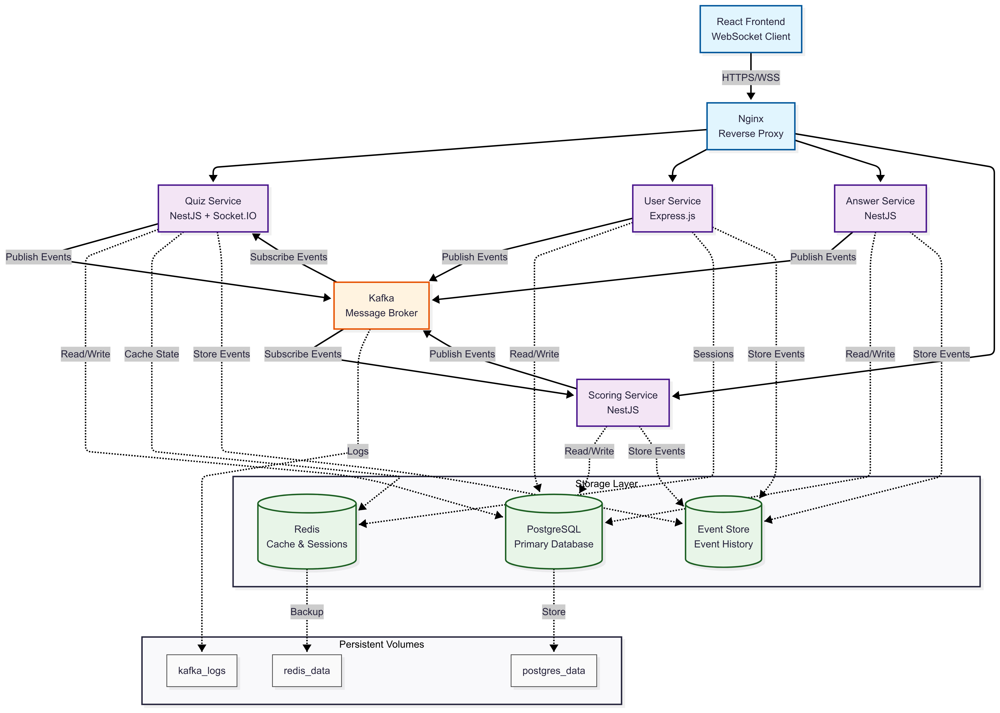
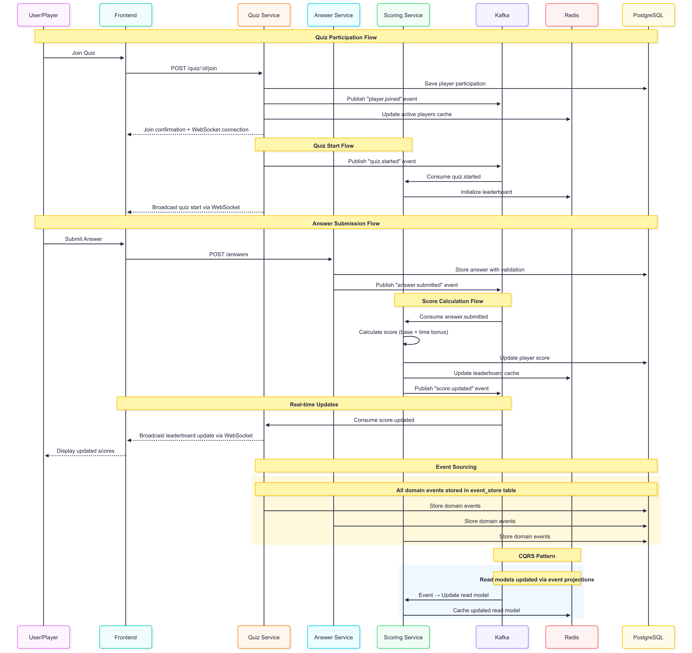

# Liệt kê các đặc tính chất lượng mong muốn đạt được với Event-driven Architecture trong bài lab04. Liệt kê các công cụ có thể sử dụng và các bước cần thực hiện, để kiểm tra các đặc tính chất lương này. Vẽ sơ đồ lưu trữ của kiến trúc để xuất? Liệt kê các công cụ có thể sử dụng và các bước cần thực hiện để cài đặt sơ đồ lưu trữ đề xuất, và để viết mã nguồn ghi và đọc các sự kiện từ hệ thống lưu trữ.

## 1. Đặc tính Chất lượng Mong muốn với EDA

### A. Scalability (Khả năng mở rộng)
**Định nghĩa**: Hệ thống có thể tăng capacity để xử lý nhiều users/requests hơn

**Cách đạt được trong project Quiz App**:
- **Horizontal scaling**: Mỗi service (User, Quiz, Answer, Scoring) có thể scale độc lập bằng cách tăng số container instances
- **Load distribution**: Kafka partitions phân phối events đến multiple consumer instances
- **Stateless services**: Services không lưu state, dễ dàng replicate
- **Database sharding**: PostgreSQL có thể shard theo quizId hoặc userId

**Metrics đo lường**:
- Concurrent users: từ 100 → 10,000 users
- Events/second: từ 1,000 → 100,000 events/s  
- Response time: giữ <200ms khi scale up
- Resource utilization: CPU <80%, Memory <85%

### B. Reliability (Độ tin cậy)
**Định nghĩa**: Hệ thống hoạt động đúng và liên tục, ngay cả khi có failures

**Cách đạt được**:
- **Fault tolerance**: Circuit breaker pattern, service failure không crash toàn hệ thống
- **Event persistence**: Kafka với replication factor=3, đảm bảo events không bị mất
- **Retry mechanisms**: Exponential backoff retry cho failed events
- **Data consistency**: Eventually consistent với compensating transactions
- **Health checks**: Container health monitoring, auto-restart failed services

**Reliability targets**:
- Uptime: 99.9% (8.76 hours downtime/year)
- Data durability: 99.999% (không mất events)
- Recovery time: <30 seconds cho service restart
- MTBF (Mean Time Between Failures): >720 hours


**Benefits**:
- Dễ maintain: Team có thể work độc lập trên mỗi service
- Flexible deployment: Deploy service bất kỳ mà không affect others
- Technology freedom: Chọn tech stack phù hợp cho từng service
- Testing isolation: Unit test service mà không cần dependency


**Performance targets**:
- API response time: <200ms cho 95% requests
- Event processing latency: <50ms từ publish đến consume
- WebSocket message delivery: <20ms
- Cache hit ratio: >90% cho user sessions
- UI responsiveness: <100ms cho user interactions

### C. Availability (Tính khả dụng)
**High Availability design**:
- **Multi-instance deployment**: Mỗi service chạy ≥2 instances
- **Load balancing**: Nginx distribute traffic across instances
- **Database replication**: PostgreSQL master-slave setup
- **Kafka clustering**: 3+ Kafka brokers với leader election
- **Graceful degradation**: Core features vẫn work khi non-critical services down

### D. Consistency (Tính nhất quán)
**Event-driven consistency model**:
- **Eventually consistent**: Data sync across services through events
- **Saga pattern**: Distributed transactions với compensating actions
- **Event sourcing**: Single source of truth từ event sequence
- **CQRS**: Tách read/write models để optimize performance
- **Conflict resolution**: Last-writer-wins với timestamps

## 2. Công cụ Kiểm tra Chất lượng

### A. Performance Testing (Kiểm tra Hiệu suất)
**Công cụ chính**:
- **Apache JMeter**: GUI-based load testing
- **Artillery**: Node.js based testing  
- **k6**: JavaScript-based load testing

**Test scenarios cơ bản**:
- Concurrent user registration: 100-1000 users/minute
- Quiz participation: 500 concurrent players
- Answer submission: 1000 answers trong 10 seconds
- WebSocket stress test: 2000 concurrent connections

**Metrics quan trọng**:
- Response time: <200ms cho 95% requests
- Throughput: Requests/second, Events/second
- Error rate: <1% cho normal load
- Resource utilization: CPU <80%, Memory <85%

### B. Reliability Testing (Kiểm tra Độ tin cậy)
**Công cụ Chaos Engineering**:
- **Chaos Monkey**: Random service termination
- **Pumba**: Docker container chaos testing

**Test scenarios**:
- Kill random microservice instances  
- Simulate database connection loss
- Kafka broker crashes
- Network partitions

**Expected results**:
- Auto-restart failed containers trong <30s
- No data loss during failures
- Core functionality vẫn available

### C. End-to-End Testing
**Tools**: Cypress, Playwright
**Test scenarios**:
- User journey: Register → Login → Create Quiz → Start Quiz
- Multi-player scenario: 10 players join, answer questions
- Real-time updates verification
- Error handling testing

## 3. Sơ đồ Kiến trúc Lưu trữ

### 3.1 Tổng quan Storage Architecture 


### 3.2 Event Flow Architecture


### 3.5 Data Storage Layers

#### Layer 1: Event Store (Kafka)
**Purpose**: Event sourcing, message streaming
**Components**:
- **Topics**: quiz-events, user-events, scoring-events  
- **Partitions**: Horizontal scaling (theo quizId)
- **Retention**: 7 days cho event replay
- **Replication**: Factor=3 cho high availability

#### Layer 2: Persistent Storage (PostgreSQL)
**Purpose**: ACID transactions, relational data integrity
**Databases**:
- **user_db**: Users, authentication, profiles
- **quiz_db**: Quizzes, questions, quiz participants  
- **answer_db**: Answer submissions, validations
- **scoring_db**: Player scores, leaderboards

**Schema design**:
```sql
-- Event Store table (cross-service)
CREATE TABLE event_store (
  id UUID PRIMARY KEY,
  aggregate_id UUID NOT NULL,
  event_type VARCHAR(100) NOT NULL,
  event_data JSONB NOT NULL,
  version INTEGER NOT NULL,
  created_at TIMESTAMP DEFAULT NOW(),
  INDEX (aggregate_id, version)
);
```

#### Layer 3: Cache Layer (Redis)  
**Purpose**: Fast access, session management, temporary state
**Data types**:
- **String**: User sessions, JWT blacklist
- **Hash**: Quiz state, player current status
- **List**: Question queues, answer history
- **Set**: Active participants, online users
- **Sorted Set**: Leaderboards, rankings
- **TTL**: Auto-expiration cho temporary data

#### Layer 4: File Storage
**Purpose**: Static assets, uploads, exports
**Solutions**:
- **Local volumes**: Development environment
- **AWS S3/MinIO**: Production file storage
- **CDN**: Global content delivery

## 4. Cài đặt Kiến trúc Lưu trữ

### 4.1 Infrastructure Setup với Docker Compose

#### A. Kafka Setup
**Công cụ**: Docker Compose, Kafdrop UI

**Basic configuration**:
```yaml
zookeeper:
  image: confluentinc/cp-zookeeper:7.0.1
  environment:
    ZOOKEEPER_CLIENT_PORT: 2181

kafka:
  image: confluentinc/cp-kafka:7.0.1
  environment:
    KAFKA_BROKER_ID: 1
    KAFKA_ZOOKEEPER_CONNECT: zookeeper:2181
    KAFKA_LISTENERS: PLAINTEXT://0.0.0.0:9092
    KAFKA_AUTO_CREATE_TOPICS_ENABLE: true
```

**Topics thiết yếu**:
- `quiz-events`: Quiz lifecycle events
- `user-events`: User activities  
- `answer-events`: Answer submissions
- `scoring-events`: Score calculations

#### B. PostgreSQL Setup
**Configuration cơ bản**:
```yaml
postgres:
  image: postgres:15
  environment:
    POSTGRES_USER: postgres
    POSTGRES_PASSWORD: password
    POSTGRES_DB: quiz_app
```

**Schema cơ bản**:
```sql
-- Quizzes table
CREATE TABLE quizzes (
  id UUID PRIMARY KEY,
  title VARCHAR(255) NOT NULL,
  host_id UUID NOT NULL,
  status VARCHAR(50) DEFAULT 'draft'
);

-- Answers table  
CREATE TABLE answers (
  id UUID PRIMARY KEY,
  quiz_id UUID NOT NULL,
  player_id UUID NOT NULL,
  submitted_answer JSONB NOT NULL,
  is_correct BOOLEAN NOT NULL
);
```

#### C. Redis Setup
```yaml
redis:
  image: redis:7-alpine
  command: redis-server --appendonly yes
  ports:
    - "6379:6379"
```

### 4.2 Development Setup
**Quick start commands**:
```bash
# Start infrastructure
docker-compose up -d postgres redis kafka

# Start services
npm run dev:all-services

# Start frontend
cd frontend && npm start
```

## 5. Code Implementation Cơ bản

### 5.1 Event Store & Repository Pattern
**Event Store Repository**:
```typescript
@Injectable()
export class EventStoreRepository {
  async saveEvent(aggregateId: string, eventType: string, eventData: any): Promise<void> {
    const event = {
      aggregateId,
      eventType,
      eventData,
      createdAt: new Date()
    };
    
    // Save to database
    await this.eventStoreRepo.save(event);
    
    // Publish to Kafka
    await this.kafkaService.publishEvent(event);
  }

  async getEvents(aggregateId: string): Promise<Event[]> {
    return await this.eventStoreRepo.find({
      where: { aggregateId },
      order: { createdAt: 'ASC' }
    });
  }
}
```

### 5.2 Kafka Producer/Consumer
**Basic Kafka Producer**:
```typescript
@Injectable()
export class KafkaProducerService {
  async publishEvent(event: DomainEvent): Promise<void> {
    const message = {
      key: event.aggregateId,
      value: JSON.stringify(event)
    };

    await this.producer.send({
      topic: 'quiz-events',
      messages: [message]
    });
  }
}
```

**Basic Event Consumer**:
```typescript
@Injectable()
export class EventConsumerService {
  @EventPattern('answer.submitted')
  async handleAnswerSubmitted(event: AnswerSubmittedEvent): Promise<void> {
    // Calculate score
    const score = await this.scoringService.calculateScore(event.payload);
    
    // Update leaderboard
    await this.leaderboardService.updateScore(score);
    
    // Notify via WebSocket
    await this.notificationService.notifyScoreUpdate(score);
  }
}
```

### 5.3 CQRS Read Models
**Leaderboard Read Model**:
```typescript
@Injectable()
export class LeaderboardProjection {
  @EventPattern('score.updated')
  async onScoreUpdated(event: ScoreUpdatedEvent): Promise<void> {
    // Update database
    await this.leaderboardRepo.upsert({
      quizId: event.quizId,
      playerId: event.playerId,
      totalScore: event.totalScore
    });

    // Update Redis cache
    await this.redisService.zadd(`leaderboard:${event.quizId}`, event.totalScore, event.playerId);
  }

  async getLeaderboard(quizId: string): Promise<LeaderboardEntry[]> {
    // Try cache first
    const cached = await this.redisService.zrevrange(`leaderboard:${quizId}`, 0, 9);
    if (cached.length > 0) return cached;

    // Fallback to database
    return await this.leaderboardRepo.find({
      where: { quizId },
      order: { totalScore: 'DESC' },
      take: 10
    });
  }
}
```

### 5.4 Error Handling & Retry Logic
**Basic Retry Pattern**:
```typescript
async processEvent(event: DomainEvent): Promise<void> {
  const maxRetries = 3;
  let attempt = 0;

  while (attempt < maxRetries) {
    try {
      await this.businessLogic(event);
      return; // Success
    } catch (error) {
      attempt++;
      if (attempt >= maxRetries) {
        // Send to dead letter queue
        await this.deadLetterService.sendToDeadLetter(event, error);
        throw error;
      }
      
      // Wait before retry
      await new Promise(resolve => setTimeout(resolve, 1000 * attempt));
    }
  }
}
```