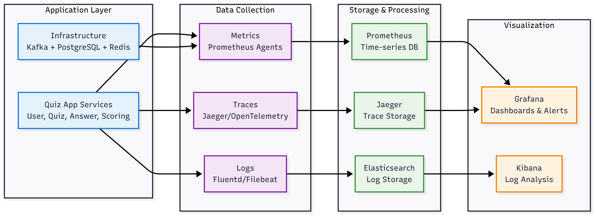
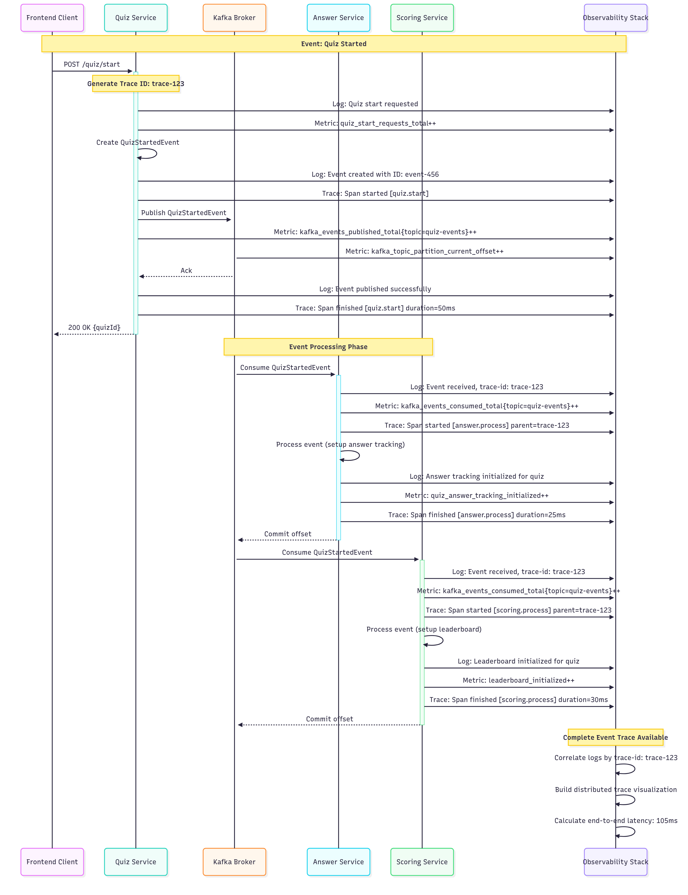

# Vẽ sơ đồ và giải thích góc nhìn giám sát (Observability) của hệ thống Event-driven trong bài lab04. Liệt kê các công cụ có thể sử dụng và các bước cần thực hiện để log, trace, và monitor các sự kiện từ lúc phát sinh đến lúc được xử lý.

## 1. Tổng quan Observability trong Event-Driven Architecture

### 1.1 Định nghĩa Observability

**Observability** là khả năng hiểu được trạng thái internal của hệ thống thông qua các outputs mà nó tạo ra. Trong Event-driven Architecture, observability trở nên cực kỳ quan trọng vì:

- **Distributed nature**: Events flow qua nhiều services và systems
- **Asynchronous processing**: Khó debug các issues realtime
- **Complex dependencies**: Service failures có thể cascade
- **Event ordering**: Cần track event sequence và causality

### 1.2 Three Pillars of Observability

#### A. Metrics (Đo lường)
- **Mục đích**: Đo lường hiệu suất hệ thống
- **Đặc điểm**: Time-series data, aggregated values
- **Sử dụng**: Alerting và monitoring trends

#### B. Logs (Nhật ký)
- **Mục đích**: Ghi lại chi tiết các events
- **Đặc điểm**: Structured/unstructured text, context-rich
- **Sử dụng**: Debugging và forensics

#### C. Traces (Dấu vết)
- **Mục đích**: Theo dõi request flow end-to-end
- **Đặc điểm**: Distributed transaction visibility
- **Sử dụng**: Performance analysis và root cause analysis

## 2. Sơ đồ Observability Architecture

### 2.1 Overall Observability View



**Luồng đơn giản hóa của Observability:**

1. **Application Layer**: Quiz App services và infrastructure tạo ra data
2. **Data Collection**: Thu thập 3 loại data (Metrics, Logs, Traces) 
3. **Storage & Processing**: Lưu trữ và xử lý data trong specialized databases
4. **Visualization**: Hiển thị insights thông qua dashboards và analytics tools

**Key Benefits của thiết kế này:**
- **Unified view**: Tất cả observability data trong một nơi
- **Real-time**: Live monitoring của event flows
- **Focused**: Tập trung vào 3 pillars chính
- **Scalable**: Dễ dàng mở rộng từng component

### 2.2 Event Lifecycle Observability Flow



## 3. Công cụ Observability cho Event-driven System

### 3.1 Metrics Collection & Storage

#### A. Prometheus Stack
**Components chính**:
- **Prometheus Server**: Metrics scraping và alerting
- **Node Exporter**: Host-level metrics (CPU, memory, disk)
- **Application Metrics**: Custom metrics từ Quiz App services

**Basic Quiz Metrics Example**:
```typescript
// Basic metrics cho Quiz App
import { Counter, Histogram, Gauge } from 'prom-client';

export const quizMetrics = {
  quizzesCreated: new Counter({
    name: 'quiz_created_total',
    help: 'Total number of quizzes created'
  }),
  
  eventProcessingTime: new Histogram({
    name: 'event_processing_duration_ms',
    help: 'Time taken to process events',
    buckets: [1, 5, 10, 25, 50, 100, 250, 500, 1000]
  }),
  
  activeQuizzes: new Gauge({
    name: 'active_quizzes_current',
    help: 'Number of currently active quizzes'
  })
};
```

#### B. Infrastructure Metrics
**Key metrics to track**:
- **Kafka**: Message rates, consumer lag, broker health
- **PostgreSQL**: Connection pools, query performance
- **Redis**: Memory usage, hit rates
- **Node**: CPU, memory, disk usage

### 3.2 Logging Stack

#### A. ELK/EFK Stack
**Components**:
- **Elasticsearch**: Log storage và search
- **Logstash/Fluentd**: Log processing và enrichment  
- **Kibana**: Log visualization và search interface

**Basic Structured Logging**:
```typescript
// Basic logger setup
import winston from 'winston';

export const logger = winston.createLogger({
  level: 'info',
  format: winston.format.combine(
    winston.format.timestamp(),
    winston.format.json()
  ),
  transports: [
    new winston.transports.Console(),
    new winston.transports.File({ filename: 'app.log' })
  ]
});

// Event logging helper
export const logEvent = (eventType: string, eventData: any) => {
  logger.info('Event processed', {
    event: {
      type: eventType,
      id: eventData.eventId,
      aggregateId: eventData.aggregateId
    }
  });
};
```

#### B. Log Structure
**Basic Event Log Format**:
```json
{
  "@timestamp": "2024-01-15T10:30:45.123Z",
  "level": "info",
  "message": "Event processed successfully",
  "service": "quiz-service",
  "traceId": "trace-abc-123",
  "event": {
    "type": "quiz.started",
    "id": "event-789",
    "aggregateId": "quiz-xyz-999"
  },
  "userId": "user-123",
  "quizId": "quiz-xyz-999"
}
```

### 3.3 Distributed Tracing

#### A. OpenTelemetry Setup
**Basic Tracing Configuration**:
```typescript
// Basic OpenTelemetry setup
import { NodeSDK } from '@opentelemetry/auto-instrumentations-node';
import { JaegerExporter } from '@opentelemetry/exporter-jaeger';

const jaegerExporter = new JaegerExporter({
  endpoint: 'http://jaeger:14268/api/traces'
});

const sdk = new NodeSDK({
  serviceName: 'quiz-service',
  spanProcessor: new BatchSpanProcessor(jaegerExporter)
});

sdk.start();
```

**Basic Event Tracing**:
```typescript
// Basic tracing trong services
import { trace } from '@opentelemetry/api';

export class QuizService {
  private tracer = trace.getTracer('quiz-service');

  async createQuiz(createQuizDto: CreateQuizDto): Promise<Quiz> {
    const span = this.tracer.startSpan('quiz.create');
    
    try {
      span.setAttributes({
        'quiz.title': createQuizDto.title,
        'quiz.questions_count': createQuizDto.questions.length
      });

      const quiz = await this.quizRepository.create(createQuizDto);
      const event = new QuizCreatedEvent(quiz.id, quiz.title);
      
      await this.kafkaProducer.publishEvent(event);
      
      span.setStatus({ code: 1 }); // OK
      return quiz;
      
    } catch (error) {
      span.recordException(error);
      span.setStatus({ code: 2, message: error.message });
      throw error;
    } finally {
      span.end();
    }
  }
}
```

#### B. Cross-Service Trace Propagation
**Basic Kafka Trace Propagation**:
```typescript
// Trace context qua Kafka messages
export class KafkaProducerService {
  async publishEvent(event: DomainEvent): Promise<void> {
    const headers: Record<string, string> = {};
    
    // Inject trace context vào headers
    propagation.inject(context.active(), headers);
    
    const message = {
      key: event.aggregateId,
      value: JSON.stringify(event),
      headers: {
        ...headers,
        'event-type': event.eventType
      }
    };

    await this.producer.send({
      topic: 'quiz-events',
      messages: [message]
    });
  }
}

// Consumer extracts trace context
export class KafkaConsumerService {
  @EventPattern('quiz.created')
  async handleQuizCreated(context: KafkaContext): Promise<void> {
    const headers = context.getMessage().headers || {};
    
    // Extract trace context
    const parentContext = propagation.extract(context.active(), headers);
    
    await context.with(parentContext, async () => {
      const event = JSON.parse(context.getMessage().value.toString());
      await this.processQuizCreated(event);
    });
  }
}
```

## 4. Implementation Steps cho Event Observability

### 4.1 Step 1: Infrastructure Setup

#### A. Basic Docker Compose cho Observability
```yaml
# docker-compose.observability.yml
version: '3.8'

services:
  # Metrics
  prometheus:
    image: prom/prometheus:latest
    ports:
      - "9090:9090"
    volumes:
      - ./monitoring/prometheus.yml:/etc/prometheus/prometheus.yml

  # Logging
  elasticsearch:
    image: docker.elastic.co/elasticsearch/elasticsearch:8.5.0
    environment:
      - discovery.type=single-node
      - xpack.security.enabled=false
    ports:
      - "9200:9200"

  kibana:
    image: docker.elastic.co/kibana/kibana:8.5.0
    ports:
      - "5601:5601"
    environment:
      - ELASTICSEARCH_HOSTS=http://elasticsearch:9200

  # Tracing
  jaeger:
    image: jaegertracing/all-in-one:latest
    ports:
      - "16686:16686" # Jaeger UI
      - "14268:14268" # HTTP collector

  # Visualization
  grafana:
    image: grafana/grafana:latest
    ports:
      - "3000:3000"
    environment:
      - GF_SECURITY_ADMIN_PASSWORD=admin123
```

#### B. Basic Prometheus Configuration
```yaml
# monitoring/prometheus.yml
global:
  scrape_interval: 15s

scrape_configs:
  - job_name: 'quiz-services'
    static_configs:
      - targets:
        - 'user-service:3001'
        - 'quiz-service:3000'
        - 'answer-service:3002'
        - 'scoring-service:3003'
    metrics_path: /metrics

  - job_name: 'kafka'
    static_configs:
      - targets: ['kafka:9308']

  - job_name: 'postgres'
    static_configs:
      - targets: ['postgres-exporter:9187']
```

### 4.2 Step 2: Application Instrumentation

#### A. Basic Metrics Implementation
```typescript
// Basic metrics middleware
import { Injectable, NestMiddleware } from '@nestjs/common';
import { Counter, Histogram } from 'prom-client';

@Injectable()
export class MetricsMiddleware implements NestMiddleware {
  private httpRequestsTotal = new Counter({
    name: 'http_requests_total',
    help: 'Total HTTP requests',
    labelNames: ['method', 'status_code']
  });

  private httpRequestDuration = new Histogram({
    name: 'http_request_duration_ms',
    help: 'HTTP request duration',
    buckets: [1, 5, 15, 50, 100, 500, 1000]
  });

  use(req: Request, res: Response, next: NextFunction) {
    const start = Date.now();
    
    res.on('finish', () => {
      const duration = Date.now() - start;
      
      this.httpRequestsTotal.inc({
        method: req.method,
        status_code: res.statusCode
      });
      
      this.httpRequestDuration.observe(duration);
    });
    
    next();
  }
}

// Metrics endpoint
@Controller('metrics')
export class MetricsController {
  @Get()
  async getMetrics(): Promise<string> {
    return await register.metrics();
  }
}
```

#### B. Basic Event Metrics
```typescript
// Simple event metrics
import { Counter, Histogram } from 'prom-client';

export const eventMetrics = {
  eventsPublished: new Counter({
    name: 'events_published_total',
    help: 'Total events published',
    labelNames: ['event_type', 'status']
  }),

  eventsConsumed: new Counter({
    name: 'events_consumed_total',
    help: 'Total events consumed',
    labelNames: ['event_type', 'status']
  }),

  eventProcessingDuration: new Histogram({
    name: 'event_processing_duration_ms',
    help: 'Event processing time',
    buckets: [1, 5, 10, 25, 50, 100, 250, 500, 1000]
  })
};

// Simple usage
export const trackEventProcessing = async (eventType: string, processingFn: () => Promise<void>) => {
  const timer = eventMetrics.eventProcessingDuration.startTimer();

  try {
    await processingFn();
    eventMetrics.eventsConsumed.inc({ event_type: eventType, status: 'success' });
  } catch (error) {
    eventMetrics.eventsConsumed.inc({ event_type: eventType, status: 'error' });
    throw error;
  } finally {
    timer();
  }
};
```

### 4.3 Step 3: Basic Logging Implementation

#### A. Simple Event Logging
```typescript
// Basic event logger
import { logger } from './logger';

export class EventLogger {
  static logEventCreated(eventType: string, eventId: string, aggregateId: string) {
    logger.info('Event created', {
      eventType,
      eventId,
      aggregateId,
      phase: 'created'
    });
  }

  static logEventPublished(eventType: string, eventId: string, topic: string) {
    logger.info('Event published', {
      eventType,
      eventId,
      topic,
      phase: 'published'
    });
  }

  static logEventConsumed(eventType: string, eventId: string) {
    logger.info('Event consumed', {
      eventType,
      eventId,
      phase: 'consumed'
    });
  }

  static logEventProcessed(eventType: string, eventId: string, duration: number, success: boolean) {
    logger.info('Event processed', {
      eventType,
      eventId,
      duration,
      success,
      phase: 'processed'
    });
  }
}
```

#### B. Basic Service Logging
```typescript
// Simple quiz service logging
export class QuizService {
  async createQuiz(createQuizDto: CreateQuizDto): Promise<Quiz> {
    const quiz = await this.quizRepository.create(createQuizDto);
    
    const event = new QuizCreatedEvent(quiz.id, quiz.title);

    // Log event creation
    EventLogger.logEventCreated('quiz.created', event.eventId, quiz.id);

    try {
      // Publish event
      await this.kafkaProducer.publishEvent(event);
      
      // Log successful publishing
      EventLogger.logEventPublished('quiz.created', event.eventId, 'quiz-events');
      
      // Update metrics
      eventMetrics.eventsPublished.inc({
        event_type: 'quiz.created',
        status: 'success'
      });

    } catch (error) {
      logger.error('Event publishing failed', { error: error.message });
      
      eventMetrics.eventsPublished.inc({
        event_type: 'quiz.created',
        status: 'error'
      });
      
      throw error;
    }

    return quiz;
  }
}
```

### 4.4 Step 4: Basic Event Tracing

#### A. Simple Event Correlation
```typescript
// Basic traceable events
export interface TraceableEvent extends DomainEvent {
  traceId: string;
  correlationId: string;
  timestamp: string;
}

// Simple event factory
export class EventFactory {
  static createEvent(eventType: string, aggregateId: string, payload: any): TraceableEvent {
    return {
      eventId: uuidv4(),
      eventType,
      aggregateId,
      payload,
      traceId: trace.getActiveSpan()?.spanContext().traceId || uuidv4(),
      correlationId: uuidv4(),
      timestamp: new Date().toISOString()
    };
  }
}
```

#### B. Basic Saga Pattern
```typescript
// Simple saga example
export class QuizCompletionSaga {
  @EventPattern('quiz.ended')
  async onQuizEnded(event: QuizEndedEvent): Promise<void> {
    try {
      // Step 1: Finalize scores
      await this.finalizeScores(event.aggregateId);
      
      // Step 2: Notify participants
      await this.notifyParticipants(event.aggregateId);
      
      logger.info('Quiz completion saga finished', { quizId: event.aggregateId });
    } catch (error) {
      logger.error('Quiz completion saga failed', { error: error.message });
    }
  }

  private async finalizeScores(quizId: string): Promise<void> {
    await this.kafkaProducer.publishEvent(
      new FinalizeScoresCommand(quizId)
    );
  }

  private async notifyParticipants(quizId: string): Promise<void> {
    await this.kafkaProducer.publishEvent(
      new NotifyParticipantsCommand(quizId)
    );
  }
}
```

## 5. Monitoring Dashboards & Alerts

### 5.1 Basic Grafana Dashboards

#### A. System Overview Dashboard
**Key panels**:
- **Event Publishing Rate**: `rate(events_published_total[5m])`
- **Event Processing Latency**: `histogram_quantile(0.95, rate(event_processing_duration_ms_bucket[5m]))`
- **Kafka Consumer Lag**: `kafka_consumer_lag`
- **Event Error Rate**: `rate(events_consumed_total{status="error"}[5m])`

#### B. Business Metrics Dashboard
**Key panels**:
- **Active Quizzes**: `active_quizzes_current`
- **Quiz Creation Rate**: `rate(quiz_created_total[5m])`
- **Answer Submission Rate**: `rate(answer_submitted_total[5m])`
- **Service Health**: `up{job="quiz-services"}`

### 5.2 Basic Alerting Rules

#### A. Event Processing Alerts
```yaml
# Basic event alerts
groups:
- name: event-alerts
  rules:
  - alert: HighEventLatency
    expr: histogram_quantile(0.95, rate(event_processing_duration_ms_bucket[5m])) > 1000
    for: 2m
    annotations:
      summary: "High event processing latency detected"

  - alert: EventProcessingErrors
    expr: rate(events_consumed_total{status="error"}[5m]) > 0.05
    for: 1m
    annotations:
      summary: "High event processing error rate"

  - alert: KafkaLag
    expr: kafka_consumer_lag > 1000
    for: 5m
    annotations:
      summary: "Kafka consumer lag is high"
```

#### B. Service Health Alerts
```yaml
# Basic service alerts
groups:
- name: service-alerts
  rules:
  - alert: ServiceDown
    expr: up{job="quiz-services"} == 0
    for: 30s
    annotations:
      summary: "Quiz service instance is down"

  - alert: HighErrorRate
    expr: rate(http_requests_total{status_code=~"5.."}[5m]) > 0.1
    for: 2m
    annotations:
      summary: "High HTTP error rate detected"
```

## 6. Log Analysis & Troubleshooting

### 6.1 Basic Kibana Queries

#### A. Event Flow Tracking
**Find specific event types**:
```
event.type: "quiz.created" AND @timestamp: [now-1h TO now]
```

**Trace events by correlation ID**:
```
correlationId: "correlation-abc-123"
```

#### B. Error Analysis
**Find failed events**:
```
level: "error" AND event.type: *
```

**Performance issues**:
```
duration: >1000 AND phase: "processed"
```

### 6.2 Basic Troubleshooting

#### A. Event Processing Delays
**Troubleshooting steps**:
1. Check Kafka consumer lag: `kafka_consumer_lag > 1000`
2. Verify service health: `up{job="quiz-services"} == 0`
3. Check processing metrics: `rate(event_processing_duration_ms_bucket[5m])`
4. Analyze error logs: `level:error AND event.type:*`

#### B. Event Ordering Issues
**Debugging steps**:
1. Check Kafka partition assignment
2. Verify event versioning in logs
3. Trace event sequence by correlationId
4. Check causation chain in Jaeger

## 7. Performance Monitoring & Optimization

### 7.1 Key Performance Metrics

#### A. Critical KPIs
**Event Performance Targets**:
- **Event E2E Latency**: P95 < 500ms
- **Event Throughput**: > 1000 events/sec  
- **Kafka Producer Latency**: P95 < 50ms
- **Consumer Lag**: < 100 messages

#### B. Basic Performance Monitoring
```typescript
// Simple performance tracking
export class PerformanceMonitor {
  async checkEventPerformance(): Promise<PerformanceReport> {
    const metrics = await this.prometheusClient.query([
      'histogram_quantile(0.95, rate(event_processing_duration_ms_bucket[5m]))',
      'rate(events_published_total[5m])',
      'kafka_consumer_lag'
    ]);

    return {
      eventLatency: metrics.latency,
      throughput: metrics.rate,
      consumerLag: metrics.lag,
      timestamp: new Date()
    };
  }

  async identifyBottlenecks(metrics: any): Promise<string[]> {
    const issues = [];
    
    if (metrics.eventLatency > 500) {
      issues.push('High event processing latency');
    }
    
    if (metrics.consumerLag > 1000) {
      issues.push('High consumer lag');
    }
    
    return issues;
  }
}
```

### 7.2 Performance Optimization Tips

**Common optimization strategies**:
- **Scale consumers** when lag is high
- **Optimize event processing** logic
- **Use batch processing** for better throughput
- **Monitor and tune** Kafka configurations
- **Implement caching** for frequently accessed data

---

Hệ thống Observability này cung cấp **end-to-end visibility** cho Event-driven Architecture của Quiz App, giúp:

- **Real-time monitoring** của event flows
- **Root cause analysis** cho issues
- **Proactive alerting** để prevent problems  
- **Performance optimization** dựa trên metrics

Với implementation này, có thể **maintain high reliability** và **quickly troubleshoot** issues trong event-driven system.
