# Vẽ sơ đồ và giải thích góc nhìn giám sát (Observability) của hệ thống Event-driven trong bài lab04. Liệt kê các công cụ có thể sử dụng và các bước cần thực hiện để log, trace, và monitor các sự kiện từ lúc phát sinh đến lúc được xử lý.

## 1. Tổng quan Observability trong Event-Driven Architecture

### 1.1 Định nghĩa Observability

**Observability** là khả năng hiểu được trạng thái internal của hệ thống thông qua các outputs mà nó tạo ra. Trong Event-driven Architecture, observability trở nên cực kỳ quan trọng vì:

- **Distributed nature**: Events flow qua nhiều services và systems
- **Asynchronous processing**: Khó debug các issues realtime
- **Complex dependencies**: Service failures có thể cascade
- **Event ordering**: Cần track event sequence và causality

### 1.2 Three Pillars of Observability

#### A. Metrics (Đo lường)
**Mục đích**: Quantitative measurements của system performance
**Đặc điểm**: 
- Time-series data với timestamps
- Aggregated values (count, average, percentiles)
- Low storage overhead
- Good for alerting và monitoring trends

#### B. Logs (Nhật ký)
**Mục đích**: Detailed records của individual events
**Đặc điểm**:
- Structured hoặc unstructured text
- Context-rich information
- High storage volume
- Good for debugging và forensics

#### C. Traces (Dấu vết)
**Mục đích**: End-to-end request flow tracking
**Đặc điểm**:
- Distributed transaction visibility
- Span relationships và dependencies
- Performance bottleneck identification
- Root cause analysis

## 2. Sơ đồ Observability Architecture

### 2.1 Overall Observability View

```mermaid
graph LR
    subgraph "Application Layer"
        SERVICES[Quiz App Services<br/>User, Quiz, Answer, Scoring]
        INFRA[Infrastructure<br/>Kafka + PostgreSQL + Redis]
    end
    
    subgraph "Data Collection"
        METRICS[📊 Metrics<br/>Prometheus Agents]
        LOGS[📄 Logs<br/>Fluentd/Filebeat]
        TRACES[🔍 Traces<br/>Jaeger/OpenTelemetry]
    end
    
    subgraph "Storage & Processing"
        PROMETHEUS[📈 Prometheus<br/>Time-series DB]
        ELASTICSEARCH[🔎 Elasticsearch<br/>Log Storage]
        JAEGER_DB[📊 Jaeger<br/>Trace Storage]
    end
    
    subgraph "Visualization"
        GRAFANA[📱 Grafana<br/>Dashboards & Alerts]
        KIBANA[🖥️ Kibana<br/>Log Analysis]
    end
    
    %% Data flow
    SERVICES --> METRICS
    SERVICES --> LOGS
    SERVICES --> TRACES
    INFRA --> METRICS
    
    METRICS --> PROMETHEUS
    LOGS --> ELASTICSEARCH
    TRACES --> JAEGER_DB
    
    PROMETHEUS --> GRAFANA
    ELASTICSEARCH --> KIBANA
    JAEGER_DB --> GRAFANA
    
    %% Styling
    classDef app fill:#e3f2fd,stroke:#1976d2,stroke-width:2px
    classDef collect fill:#f3e5f5,stroke:#7b1fa2,stroke-width:2px
    classDef store fill:#e8f5e8,stroke:#388e3c,stroke-width:2px
    classDef viz fill:#fff3e0,stroke:#f57c00,stroke-width:2px
    
    class SERVICES,INFRA app
    class METRICS,LOGS,TRACES collect
    class PROMETHEUS,ELASTICSEARCH,JAEGER_DB store
    class GRAFANA,KIBANA viz
```



**Luồng đơn giản hóa của Observability:**

1. **Application Layer**: Quiz App services và infrastructure tạo ra data
2. **Data Collection**: Thu thập 3 loại data (Metrics, Logs, Traces) 
3. **Storage & Processing**: Lưu trữ và xử lý data trong specialized databases
4. **Visualization**: Hiển thị insights thông qua dashboards và analytics tools

**Key Benefits của thiết kế này:**
- **Unified view**: Tất cả observability data trong một nơi
- **Real-time**: Live monitoring của event flows
- **Focused**: Tập trung vào 3 pillars chính
- **Scalable**: Dễ dàng mở rộng từng component

### 2.2 Event Lifecycle Observability Flow


## 3. Công cụ Observability cho Event-driven System

### 3.1 Metrics Collection & Storage

#### A. Prometheus Stack
**Mục đích**: Time-series metrics collection và alerting
**Components**:
```yaml
# Prometheus configuration
Prometheus Server:
  - Metrics scraping từ service endpoints
  - Rule evaluation cho alerting
  - Local storage (15 days retention)
  - PromQL query language

Node Exporter:
  - Host-level metrics (CPU, memory, disk, network)
  - System metrics cho infrastructure monitoring

Application Metrics:
  - Custom metrics từ Quiz App services
  - Business metrics (quiz created, answers submitted)
  - Performance metrics (request duration, error rates)
```

**Quiz App Metrics Examples**:
```typescript
// services/quiz-service/src/metrics/quiz.metrics.ts
import { register, Counter, Histogram, Gauge } from 'prom-client';

export const quizMetrics = {
  quizzesCreated: new Counter({
    name: 'quiz_created_total',
    help: 'Total number of quizzes created',
    labelNames: ['status', 'host_id']
  }),
  
  quizDuration: new Histogram({
    name: 'quiz_duration_seconds',
    help: 'Quiz completion time in seconds',
    labelNames: ['quiz_id'],
    buckets: [30, 60, 120, 300, 600, 1200] // 30s to 20min
  }),
  
  activeQuizzes: new Gauge({
    name: 'active_quizzes_current',
    help: 'Number of currently active quizzes',
    labelNames: ['status']
  }),
  
  eventProcessingTime: new Histogram({
    name: 'event_processing_duration_ms',
    help: 'Time taken to process events',
    labelNames: ['event_type', 'service'],
    buckets: [1, 5, 10, 25, 50, 100, 250, 500, 1000]
  })
};
```

#### B. Infrastructure Metrics
**Kafka Metrics với JMX Exporter**:
```yaml
# kafka-jmx-config.yml
rules:
- pattern: kafka.server<type=BrokerTopicMetrics, name=MessagesInPerSec, topic=(.+)><>OneMinuteRate
  name: kafka_topic_messages_in_per_sec
  labels:
    topic: $1

- pattern: kafka.server<type=BrokerTopicMetrics, name=BytesInPerSec, topic=(.+)><>OneMinuteRate
  name: kafka_topic_bytes_in_per_sec
  labels:
    topic: $1

- pattern: kafka.consumer<type=consumer-fetch-manager-metrics, client-id=(.+), topic=(.+), partition=(.+)><>lag
  name: kafka_consumer_lag
  labels:
    client_id: $1
    topic: $2
    partition: $3
```

**PostgreSQL Metrics với postgres_exporter**:
```sql
# Custom queries cho Quiz App
- name: quiz_database_stats
  query: |
    SELECT 
      schemaname,
      tablename,
      n_tup_ins as inserts,
      n_tup_upd as updates,
      n_tup_del as deletes,
      n_live_tup as live_tuples,
      n_dead_tup as dead_tuples
    FROM pg_stat_user_tables
    WHERE schemaname NOT IN ('information_schema', 'pg_catalog')
  metrics:
    - schemaname:
        usage: "LABEL"
    - tablename:
        usage: "LABEL"
    - inserts:
        usage: "COUNTER"
    - updates:
        usage: "COUNTER"
    - deletes:
        usage: "COUNTER"
    - live_tuples:
        usage: "GAUGE"
    - dead_tuples:
        usage: "GAUGE"
```

### 3.2 Logging Stack

#### A. ELK/EFK Stack
**Elasticsearch**: Distributed search engine cho log storage
**Logstash/Fluentd**: Log processing và enrichment
**Kibana**: Log visualization và search interface

**Structured Logging cho Quiz App**:
```typescript
// shared/utils/logger.ts
import winston from 'winston';
import { format } from 'winston';

const logFormat = format.combine(
  format.timestamp(),
  format.errors({ stack: true }),
  format.json(),
  format.printf(({ timestamp, level, message, service, traceId, spanId, ...meta }) => {
    return JSON.stringify({
      '@timestamp': timestamp,
      level,
      message,
      service,
      traceId,
      spanId,
      event: meta.event || null,
      userId: meta.userId || null,
      quizId: meta.quizId || null,
      duration: meta.duration || null,
      error: meta.error || null,
      ...meta
    });
  })
);

export const logger = winston.createLogger({
  level: process.env.LOG_LEVEL || 'info',
  format: logFormat,
  transports: [
    new winston.transports.Console(),
    new winston.transports.File({ 
      filename: '/var/log/quiz-app/app.log',
      maxsize: 10485760, // 10MB
      maxFiles: 5
    })
  ]
});

// Event-specific logging
export const logEvent = (eventType: string, eventData: any, context: any = {}) => {
  logger.info('Event processed', {
    event: {
      type: eventType,
      id: eventData.eventId,
      aggregateId: eventData.aggregateId,
      version: eventData.version,
      timestamp: eventData.timestamp
    },
    ...context
  });
};
```

**Fluentd Configuration cho Event Logs**:
```yaml
# fluentd/fluent.conf
<source>
  @type tail
  path /var/log/quiz-app/*.log
  pos_file /var/log/fluentd/quiz-app.log.pos
  tag quiz-app.*
  format json
  time_key @timestamp
  time_format %Y-%m-%dT%H:%M:%S.%LZ
</source>

<filter quiz-app.**>
  @type parser
  key_name message
  reserve_data true
  <parse>
    @type json
  </parse>
</filter>

<filter quiz-app.**>
  @type record_transformer
  <record>
    hostname ${hostname}
    environment ${ENV}
    cluster_name quiz-app-cluster
  </record>
</filter>

# Enrich event logs với metadata
<filter quiz-app.** >
  @type grep
  <regexp>
    key event.type
    pattern ^(quiz\.|answer\.|score\.|user\.)
  </regexp>
</filter>

<match quiz-app.**>
  @type elasticsearch
  host elasticsearch
  port 9200
  index_name quiz-app-logs-%Y.%m.%d
  type_name _doc
  flush_interval 5s
  buffer_chunk_limit 2M
  buffer_queue_limit 32
</match>
```

#### B. Log Parsing & Enrichment
**Event Log Structure**:
```json
{
  "@timestamp": "2024-01-15T10:30:45.123Z",
  "level": "info",
  "message": "Event processed successfully",
  "service": "quiz-service",
  "traceId": "trace-abc-123",
  "spanId": "span-def-456",
  "event": {
    "type": "quiz.started",
    "id": "event-789",
    "aggregateId": "quiz-xyz-999",
    "version": 1,
    "timestamp": "2024-01-15T10:30:45.000Z"
  },
  "userId": "user-123",
  "quizId": "quiz-xyz-999",
  "duration": 45,
  "hostname": "quiz-service-pod-1",
  "environment": "production",
  "cluster_name": "quiz-app-cluster"
}
```

### 3.3 Distributed Tracing

#### A. OpenTelemetry Implementation
**Instrumentation Setup**:
```typescript
// shared/tracing/opentelemetry.ts
import { NodeSDK } from '@opentelemetry/auto-instrumentations-node';
import { Resource } from '@opentelemetry/resources';
import { SemanticResourceAttributes } from '@opentelemetry/semantic-conventions';
import { JaegerExporter } from '@opentelemetry/exporter-jaeger';
import { BatchSpanProcessor } from '@opentelemetry/sdk-trace-base';

const jaegerExporter = new JaegerExporter({
  endpoint: process.env.JAEGER_ENDPOINT || 'http://jaeger:14268/api/traces',
});

const sdk = new NodeSDK({
  resource: new Resource({
    [SemanticResourceAttributes.SERVICE_NAME]: process.env.SERVICE_NAME || 'quiz-app',
    [SemanticResourceAttributes.SERVICE_VERSION]: process.env.SERVICE_VERSION || '1.0.0',
    [SemanticResourceAttributes.DEPLOYMENT_ENVIRONMENT]: process.env.NODE_ENV || 'development'
  }),
  spanProcessor: new BatchSpanProcessor(jaegerExporter),
  instrumentations: [] // Auto-instrumentation enabled
});

sdk.start();

// Custom tracing utilities
export const createEventSpan = (tracer: any, eventType: string, parentContext?: any) => {
  return tracer.startSpan(`event.${eventType}`, {
    parent: parentContext,
    attributes: {
      'event.type': eventType,
      'component': 'event-processor'
    }
  });
};
```

**Event Processing Tracing**:
```typescript
// services/quiz-service/src/services/quiz.service.ts
import { trace, context } from '@opentelemetry/api';
import { logger } from '../../../shared/utils/logger';

export class QuizService {
  private tracer = trace.getTracer('quiz-service');

  async createQuiz(createQuizDto: CreateQuizDto, hostId: string): Promise<Quiz> {
    const span = this.tracer.startSpan('quiz.create');
    
    try {
      span.setAttributes({
        'quiz.title': createQuizDto.title,
        'quiz.host_id': hostId,
        'quiz.questions_count': createQuizDto.questions.length
      });

      // Business logic
      const quiz = await this.quizRepository.create({...createQuizDto, hostId});
      
      // Create và publish event
      const event = new QuizCreatedEvent(quiz.id, quiz.title, hostId, quiz.questions);
      
      // Propagate trace context to event
      const eventSpan = this.tracer.startSpan('event.quiz.created', { parent: span });
      eventSpan.setAttributes({
        'event.id': event.eventId,
        'event.type': 'quiz.created',
        'event.aggregate_id': quiz.id
      });

      await context.with(trace.setSpan(context.active(), eventSpan), async () => {
        await this.kafkaProducer.publishEvent(event);
        
        logger.info('Quiz created successfully', {
          quizId: quiz.id,
          eventId: event.eventId,
          traceId: span.spanContext().traceId,
          spanId: span.spanContext().spanId,
          duration: Date.now() - span.startTime
        });
      });

      eventSpan.end();
      span.setStatus({ code: 1 }); // OK
      
      return quiz;
      
    } catch (error) {
      span.recordException(error);
      span.setStatus({ code: 2, message: error.message }); // ERROR
      throw error;
    } finally {
      span.end();
    }
  }
}
```

#### B. Cross-Service Trace Propagation
**Kafka Message Headers cho Trace Context**:
```typescript
// shared/services/kafka-producer.service.ts
import { trace, propagation, context } from '@opentelemetry/api';

export class KafkaProducerService {
  async publishEvent(event: DomainEvent): Promise<void> {
    const span = trace.getActiveSpan();
    const headers: Record<string, string> = {};
    
    // Inject trace context vào Kafka headers
    propagation.inject(context.active(), headers);
    
    const message = {
      key: event.aggregateId,
      value: JSON.stringify(event),
      headers: {
        ...headers,
        'event-type': event.eventType,
        'event-id': event.eventId,
        'aggregate-type': event.aggregateType,
        'content-type': 'application/json'
      }
    };

    await this.producer.send({
      topic: this.getTopicForEvent(event.eventType),
      messages: [message]
    });
  }
}

// Consumer side - extract trace context
export class KafkaConsumerService {
  @EventPattern('quiz.created')
  async handleQuizCreated(context: KafkaContext): Promise<void> {
    const message = context.getMessage();
    const headers = message.headers || {};
    
    // Extract trace context từ headers
    const parentContext = propagation.extract(context.active(), headers);
    
    await context.with(parentContext, async () => {
      const span = trace.getActiveSpan();
      const event = JSON.parse(message.value.toString());
      
      span?.setAttributes({
        'kafka.topic': context.getTopic(),
        'kafka.partition': context.getPartition(),
        'kafka.offset': context.getMessage().offset,
        'event.type': event.eventType,
        'event.id': event.eventId
      });

      await this.processQuizCreated(event);
    });
  }
}
```

## 4. Implementation Steps cho Event Observability

### 4.1 Step 1: Infrastructure Setup

#### A. Docker Compose cho Observability Stack
```yaml
# docker-compose.observability.yml
version: '3.8'

services:
  # Metrics Stack
  prometheus:
    image: prom/prometheus:v2.40.0
    ports:
      - "9090:9090"
    volumes:
      - ./monitoring/prometheus/prometheus.yml:/etc/prometheus/prometheus.yml
      - ./monitoring/prometheus/rules:/etc/prometheus/rules
      - prometheus_data:/prometheus
    command:
      - '--config.file=/etc/prometheus/prometheus.yml'
      - '--storage.tsdb.path=/prometheus'
      - '--storage.tsdb.retention.time=15d'
      - '--web.console.libraries=/etc/prometheus/console_libraries'
      - '--web.console.templates=/etc/prometheus/consoles'
      - '--web.enable-lifecycle'
      - '--web.enable-admin-api'

  alertmanager:
    image: prom/alertmanager:v0.25.0
    ports:
      - "9093:9093"
    volumes:
      - ./monitoring/alertmanager/alertmanager.yml:/etc/alertmanager/alertmanager.yml
      - alertmanager_data:/alertmanager

  # Logging Stack  
  elasticsearch:
    image: docker.elastic.co/elasticsearch/elasticsearch:8.5.0
    environment:
      - discovery.type=single-node
      - "ES_JAVA_OPTS=-Xms2g -Xmx2g"
      - xpack.security.enabled=false
    ports:
      - "9200:9200"
    volumes:
      - elasticsearch_data:/usr/share/elasticsearch/data

  kibana:
    image: docker.elastic.co/kibana/kibana:8.5.0
    ports:
      - "5601:5601"
    environment:
      - ELASTICSEARCH_HOSTS=http://elasticsearch:9200
    depends_on:
      - elasticsearch

  logstash:
    image: docker.elastic.co/logstash/logstash:8.5.0
    ports:
      - "5044:5044"
      - "9600:9600"
    volumes:
      - ./monitoring/logstash/pipeline:/usr/share/logstash/pipeline
      - ./monitoring/logstash/logstash.yml:/usr/share/logstash/config/logstash.yml
    depends_on:
      - elasticsearch

  # Tracing Stack
  jaeger:
    image: jaegertracing/all-in-one:1.40
    ports:
      - "16686:16686" # Jaeger UI
      - "14268:14268" # HTTP collector
      - "14250:14250" # gRPC collector
    environment:
      - COLLECTOR_OTLP_ENABLED=true

  # Visualization
  grafana:
    image: grafana/grafana:9.3.0
    ports:
      - "3000:3000"
    environment:
      - GF_SECURITY_ADMIN_PASSWORD=admin123
    volumes:
      - ./monitoring/grafana/datasources:/etc/grafana/provisioning/datasources
      - ./monitoring/grafana/dashboards:/etc/grafana/provisioning/dashboards
      - grafana_data:/var/lib/grafana

volumes:
  prometheus_data:
  alertmanager_data:
  elasticsearch_data:
  grafana_data:
```

#### B. Prometheus Configuration
```yaml
# monitoring/prometheus/prometheus.yml
global:
  scrape_interval: 15s
  evaluation_interval: 15s

rule_files:
  - "rules/*.yml"

alerting:
  alertmanagers:
    - static_configs:
        - targets:
          - alertmanager:9093

scrape_configs:
  # Quiz App Services
  - job_name: 'quiz-services'
    static_configs:
      - targets:
        - 'user-service:3001'
        - 'quiz-service:3000'
        - 'answer-service:3002'
        - 'scoring-service:3003'
    metrics_path: /metrics
    scrape_interval: 10s

  # Infrastructure metrics
  - job_name: 'kafka'
    static_configs:
      - targets: ['kafka:9308'] # JMX exporter port
    scrape_interval: 30s

  - job_name: 'postgres'
    static_configs:
      - targets: ['postgres-exporter:9187']
    scrape_interval: 30s

  - job_name: 'redis'
    static_configs:
      - targets: ['redis-exporter:9121']
    scrape_interval: 30s

  # Node metrics
  - job_name: 'node'
    static_configs:
      - targets: ['node-exporter:9100']
    scrape_interval: 30s
```

### 4.2 Step 2: Application Instrumentation

#### A. Metrics Implementation trong Services
```typescript
// services/quiz-service/src/middleware/metrics.middleware.ts
import { Injectable, NestMiddleware } from '@nestjs/common';
import { Request, Response, NextFunction } from 'express';
import { register, Counter, Histogram } from 'prom-client';

@Injectable()
export class MetricsMiddleware implements NestMiddleware {
  private httpRequestsTotal = new Counter({
    name: 'http_requests_total',
    help: 'Total number of HTTP requests',
    labelNames: ['method', 'route', 'status_code'],
    registers: [register]
  });

  private httpRequestDuration = new Histogram({
    name: 'http_request_duration_ms',
    help: 'Duration of HTTP requests in milliseconds',
    labelNames: ['method', 'route', 'status_code'],
    buckets: [0.1, 5, 15, 50, 100, 500, 1000],
    registers: [register]
  });

  use(req: Request, res: Response, next: NextFunction) {
    const start = Date.now();
    
    res.on('finish', () => {
      const duration = Date.now() - start;
      const route = req.route?.path || req.path;
      
      this.httpRequestsTotal.inc({
        method: req.method,
        route,
        status_code: res.statusCode
      });
      
      this.httpRequestDuration.observe(
        { method: req.method, route, status_code: res.statusCode },
        duration
      );
    });
    
    next();
  }
}

// Metrics endpoint
@Controller('metrics')
export class MetricsController {
  @Get()
  async getMetrics(): Promise<string> {
    return await register.metrics();
  }
}
```

#### B. Event-specific Metrics
```typescript
// shared/metrics/event.metrics.ts
import { Counter, Histogram, Gauge } from 'prom-client';

export const eventMetrics = {
  // Event publishing metrics
  eventsPublished: new Counter({
    name: 'events_published_total',
    help: 'Total number of events published',
    labelNames: ['event_type', 'topic', 'service', 'status']
  }),

  eventPublishDuration: new Histogram({
    name: 'event_publish_duration_ms',
    help: 'Time taken to publish events',
    labelNames: ['event_type', 'topic', 'service'],
    buckets: [1, 5, 10, 25, 50, 100, 250, 500]
  }),

  // Event consumption metrics
  eventsConsumed: new Counter({
    name: 'events_consumed_total',
    help: 'Total number of events consumed',
    labelNames: ['event_type', 'topic', 'service', 'status']
  }),

  eventProcessingDuration: new Histogram({
    name: 'event_processing_duration_ms',
    help: 'Time taken to process events',
    labelNames: ['event_type', 'service', 'status'],
    buckets: [1, 5, 10, 25, 50, 100, 250, 500, 1000]
  }),

  // Event lag metrics  
  eventLag: new Gauge({
    name: 'event_consumer_lag_seconds',
    help: 'Lag between event creation and processing',
    labelNames: ['event_type', 'consumer_group', 'topic', 'partition']
  }),

  // Business metrics
  quizEventsTotal: new Counter({
    name: 'quiz_events_total',
    help: 'Total quiz-related events',
    labelNames: ['event_type', 'quiz_id']
  }),

  activeQuizSessions: new Gauge({
    name: 'active_quiz_sessions',
    help: 'Number of active quiz sessions',
    labelNames: ['quiz_id']
  })
};

// Usage trong event handlers
export const trackEventProcessing = (
  eventType: string, 
  service: string, 
  processingFn: () => Promise<void>
) => {
  return async () => {
    const startTime = Date.now();
    const timer = eventMetrics.eventProcessingDuration.startTimer({
      event_type: eventType,
      service: service
    });

    try {
      await processingFn();
      
      eventMetrics.eventsConsumed.inc({
        event_type: eventType,
        service: service,
        status: 'success'
      });
      
    } catch (error) {
      eventMetrics.eventsConsumed.inc({
        event_type: eventType,
        service: service,
        status: 'error'
      });
      throw error;
    } finally {
      timer();
    }
  };
};
```

### 4.3 Step 3: Logging Implementation

#### A. Structured Event Logging
```typescript
// shared/utils/event-logger.ts
import { logger } from './logger';
import { trace } from '@opentelemetry/api';

export interface EventLogContext {
  eventId: string;
  eventType: string;
  aggregateId: string;
  aggregateType: string;
  version: number;
  userId?: string;
  quizId?: string;
  correlationId?: string;
}

export class EventLogger {
  static logEventCreated(context: EventLogContext, payload: any) {
    const span = trace.getActiveSpan();
    const traceId = span?.spanContext().traceId;
    const spanId = span?.spanContext().spanId;

    logger.info('Event created', {
      ...context,
      traceId,
      spanId,
      payload: JSON.stringify(payload),
      phase: 'created',
      timestamp: new Date().toISOString()
    });
  }

  static logEventPublished(context: EventLogContext, topic: string, partition?: number) {
    const span = trace.getActiveSpan();
    const traceId = span?.spanContext().traceId;
    const spanId = span?.spanContext().spanId;

    logger.info('Event published', {
      ...context,
      traceId,
      spanId,
      kafka: { topic, partition },
      phase: 'published',
      timestamp: new Date().toISOString()
    });
  }

  static logEventConsumed(context: EventLogContext, consumerGroup: string, offset: string) {
    const span = trace.getActiveSpan();
    const traceId = span?.spanContext().traceId;
    const spanId = span?.spanContext().spanId;

    logger.info('Event consumed', {
      ...context,
      traceId,
      spanId,
      kafka: { consumerGroup, offset },
      phase: 'consumed',
      timestamp: new Date().toISOString()
    });
  }

  static logEventProcessed(context: EventLogContext, processingTime: number, result: 'success' | 'error', error?: Error) {
    const span = trace.getActiveSpan();
    const traceId = span?.spanContext().traceId;
    const spanId = span?.spanContext().spanId;

    logger.info('Event processed', {
      ...context,
      traceId,
      spanId,
      processing: {
        duration: processingTime,
        result,
        error: error?.message
      },
      phase: 'processed',
      timestamp: new Date().toISOString()
    });
  }

  static logEventError(context: EventLogContext, error: Error, phase: string) {
    const span = trace.getActiveSpan();
    const traceId = span?.spanContext().traceId;
    const spanId = span?.spanContext().spanId;

    logger.error('Event processing error', {
      ...context,
      traceId,
      spanId,
      error: {
        message: error.message,
        stack: error.stack,
        name: error.name
      },
      phase,
      timestamp: new Date().toISOString()
    });
  }
}
```

#### B. Quiz Service Event Logging Example
```typescript
// services/quiz-service/src/services/quiz.service.ts
import { EventLogger } from '../../../shared/utils/event-logger';
import { eventMetrics } from '../../../shared/metrics/event.metrics';

export class QuizService {
  async createQuiz(createQuizDto: CreateQuizDto, hostId: string): Promise<Quiz> {
    const quiz = await this.quizRepository.create({...createQuizDto, hostId});
    
    // Create event
    const event = new QuizCreatedEvent(quiz.id, quiz.title, hostId, quiz.questions);
    const eventContext: EventLogContext = {
      eventId: event.eventId,
      eventType: 'quiz.created',
      aggregateId: quiz.id,
      aggregateType: 'quiz',
      version: 1,
      userId: hostId,
      quizId: quiz.id
    };

    // Log event creation
    EventLogger.logEventCreated(eventContext, {
      title: quiz.title,
      questionsCount: quiz.questions.length
    });

    try {
      // Publish event
      const startTime = Date.now();
      await this.kafkaProducer.publishEvent(event);
      const publishTime = Date.now() - startTime;

      // Log successful publishing
      EventLogger.logEventPublished(eventContext, 'quiz-events');
      
      // Update metrics
      eventMetrics.eventsPublished.inc({
        event_type: 'quiz.created',
        topic: 'quiz-events',
        service: 'quiz-service',
        status: 'success'
      });
      
      eventMetrics.eventPublishDuration.observe({
        event_type: 'quiz.created',
        topic: 'quiz-events',
        service: 'quiz-service'
      }, publishTime);

    } catch (error) {
      EventLogger.logEventError(eventContext, error, 'publishing');
      
      eventMetrics.eventsPublished.inc({
        event_type: 'quiz.created',
        topic: 'quiz-events',
        service: 'quiz-service',
        status: 'error'
      });
      
      throw error;
    }

    return quiz;
  }
}
```

### 4.4 Step 4: End-to-End Event Tracing

#### A. Event Correlation ID System
```typescript
// shared/types/event.types.ts
export interface TraceableEvent extends DomainEvent {
  traceId: string;
  spanId: string;
  parentSpanId?: string;
  correlationId: string;
  causationId?: string; // ID of the event that caused this event
  timestamp: string;
  metadata: {
    service: string;
    version: string;
    environment: string;
  };
}

// Event enrichment với trace context
export class TraceableEventFactory {
  static createEvent<T extends DomainEvent>(
    eventType: string,
    aggregateId: string,
    payload: any,
    causationEvent?: TraceableEvent
  ): TraceableEvent {
    const span = trace.getActiveSpan();
    const spanContext = span?.spanContext();
    
    return {
      eventId: uuidv4(),
      eventType,
      aggregateId,
      aggregateType: this.getAggregateType(aggregateId),
      payload,
      version: 1,
      traceId: spanContext?.traceId || uuidv4(),
      spanId: spanContext?.spanId || uuidv4(),
      parentSpanId: causationEvent?.spanId,
      correlationId: causationEvent?.correlationId || uuidv4(),
      causationId: causationEvent?.eventId,
      timestamp: new Date().toISOString(),
      metadata: {
        service: process.env.SERVICE_NAME || 'unknown',
        version: process.env.SERVICE_VERSION || '1.0.0',
        environment: process.env.NODE_ENV || 'development'
      }
    } as TraceableEvent;
  }
}
```

#### B. Event Saga Tracing
```typescript
// services/scoring-service/src/sagas/quiz-completion.saga.ts
export class QuizCompletionSaga {
  @EventPattern('quiz.ended')
  async onQuizEnded(event: QuizEndedEvent): Promise<void> {
    const sagaId = `quiz-completion-${event.aggregateId}`;
    const state = new QuizCompletionState(sagaId, event.aggregateId);
    
    this.sagaStates.set(sagaId, state);
    
    // Step 1: Finalize all scores
    await this.finalizeScores(event.aggregateId);
    state.markScoresFinalized();
    
    // Step 2: Generate quiz report
    await this.generateQuizReport(event.aggregateId);
    state.markReportGenerated();
    
    // Step 3: Notify participants
    await this.notifyParticipants(event.aggregateId, event.payload.participants);
    state.markParticipantsNotified();
    
    // Complete saga
    state.markCompleted();
    this.sagaStates.delete(sagaId);
  }

  @EventPattern('score.finalization.failed')
  async onScoreFinalizationFailed(event: ScoreFinalizationFailedEvent): Promise<void> {
    const sagaId = `quiz-completion-${event.aggregateId}`;
    const state = this.sagaStates.get(sagaId);
    
    if (state) {
      // Compensating action: revert quiz to ended-with-errors state
      await this.revertQuizCompletion(event.aggregateId);
      state.markFailed('Score finalization failed');
    }
  }

  private async finalizeScores(quizId: string): Promise<void> {
    try {
      await this.kafkaProducer.publishEvent(
        new FinalizeScoresCommand(quizId)
      );
    } catch (error) {
      await this.kafkaProducer.publishEvent(
        new ScoreFinalizationFailedEvent(quizId, error.message)
      );
      throw error;
    }
  }

  private async generateQuizReport(quizId: string): Promise<void> {
    // Generate comprehensive quiz analytics
    const analytics = await this.analyticsService.generateQuizReport(quizId);
    
    await this.kafkaProducer.publishEvent(
      new QuizReportGeneratedEvent(quizId, analytics)
    );
  }

  private async notifyParticipants(quizId: string, participants: string[]): Promise<void> {
    const notifications = participants.map(playerId => 
      new ParticipantNotificationEvent(quizId, playerId, 'quiz_completed')
    );
    
    await this.kafkaProducer.publishBatch(notifications);
  }
}
```

## 5. Monitoring Dashboards & Alerts

### 5.1 Grafana Dashboard Configuration

#### A. Event-driven System Overview Dashboard
```json
{
  "dashboard": {
    "title": "Quiz App - Event-driven System Overview",
    "panels": [
      {
        "title": "Event Publishing Rate",
        "type": "graph",
        "targets": [
          {
            "expr": "rate(events_published_total[5m])",
            "legendFormat": "{{event_type}} - {{service}}"
          }
        ]
      },
      {
        "title": "Event Processing Latency",
        "type": "heatmap",
        "targets": [
          {
            "expr": "histogram_quantile(0.95, rate(event_processing_duration_ms_bucket[5m]))",
            "legendFormat": "P95 - {{event_type}}"
          }
        ]
      },
      {
        "title": "Kafka Consumer Lag",
        "type": "graph",
        "targets": [
          {
            "expr": "kafka_consumer_lag",
            "legendFormat": "{{topic}} - {{partition}} - {{consumer_group}}"
          }
        ]
      },
      {
        "title": "Event Error Rate",
        "type": "stat",
        "targets": [
          {
            "expr": "rate(events_consumed_total{status=\"error\"}[5m]) / rate(events_consumed_total[5m]) * 100",
            "legendFormat": "Error Rate %"
          }
        ]
      }
    ]
  }
}
```

#### B. Quiz Application Business Metrics Dashboard
```json
{
  "dashboard": {
    "title": "Quiz App - Business Metrics",
    "panels": [
      {
        "title": "Active Quizzes",
        "type": "stat",
        "targets": [
          {
            "expr": "active_quizzes_current",
            "legendFormat": "Active Quizzes"
          }
        ]
      },
      {
        "title": "Quiz Creation Rate",
        "type": "graph",
        "targets": [
          {
            "expr": "rate(quiz_created_total[5m])",
            "legendFormat": "Quizzes/min"
          }
        ]
      },
      {
        "title": "Answer Submission Rate",
        "type": "graph",
        "targets": [
          {
            "expr": "rate(answer_submitted_total[5m])",
            "legendFormat": "Answers/min"
          }
        ]
      },
      {
        "title": "Quiz Completion Time Distribution",
        "type": "heatmap",
        "targets": [
          {
            "expr": "histogram_quantile(0.50, rate(quiz_duration_seconds_bucket[5m]))",
            "legendFormat": "P50"
          },
          {
            "expr": "histogram_quantile(0.95, rate(quiz_duration_seconds_bucket[5m]))",
            "legendFormat": "P95"
          }
        ]
      }
    ]
  }
}
```

### 5.2 Alerting Rules

#### A. Event Processing Alerts
```yaml
# monitoring/prometheus/rules/event-alerts.yml
groups:
- name: event-processing-alerts
  rules:
  - alert: HighEventProcessingLatency
    expr: histogram_quantile(0.95, rate(event_processing_duration_ms_bucket[5m])) > 1000
    for: 2m
    labels:
      severity: warning
      team: platform
    annotations:
      summary: "High event processing latency detected"
      description: "Event processing P95 latency is {{ $value }}ms for {{ $labels.event_type }} in {{ $labels.service }}"

  - alert: EventProcessingErrorRate
    expr: rate(events_consumed_total{status="error"}[5m]) / rate(events_consumed_total[5m]) > 0.05
    for: 1m
    labels:
      severity: critical
      team: platform
    annotations:
      summary: "High event processing error rate"
      description: "Event processing error rate is {{ $value | humanizePercentage }}"

  - alert: KafkaLag
    expr: kafka_consumer_lag_sum > 1000
    for: 5m
    labels:
      severity: warning
      team: platform
    annotations:
      summary: "Kafka consumer lag is high: {{ $value }}"
```

#### B. Business Logic Alerts
```yaml
# monitoring/prometheus/rules/business-alerts.yml
groups:
- name: business-alerts
  rules:
  - alert: QuizCreationRateDrop
    expr: rate(quiz_created_total[10m]) < 0.1
    for: 5m
    labels:
      severity: warning
      team: product
    annotations:
      summary: "Quiz creation rate dropped significantly"
      description: "Quiz creation rate is {{ $value }} quizzes/sec, below normal threshold"

  - alert: HighAnswerSubmissionErrors
    expr: rate(answer_submitted_total{status="error"}[5m]) / rate(answer_submitted_total[5m]) > 0.02
    for: 2m
    labels:
      severity: warning
      team: product
    annotations:
      summary: "High answer submission error rate"
      description: "Answer submission error rate is {{ $value | humanizePercentage }}"

  - alert: QuizServiceDown
    expr: up{job="quiz-services", instance=~".*quiz-service.*"} == 0
    for: 30s
    labels:
      severity: critical
      team: platform
    annotations:
      summary: "Quiz service instance is down"
      description: "Quiz service instance {{ $labels.instance }} is not responding"
```

## 6. Log Analysis & Troubleshooting

### 6.1 Kibana Queries cho Event Debugging

#### A. Event Flow Tracking
```javascript
// Kibana search query cho tracking specific event flow
{
  "query": {
    "bool": {
      "must": [
        {
          "match": {
            "event.type": "quiz.created"
          }
        },
        {
          "range": {
            "@timestamp": {
              "gte": "now-1h",
              "lte": "now"
            }
          }
        }
      ]
    }
  },
  "sort": [
    {
      "@timestamp": {
        "order": "desc"
      }
    }
  ]
}

// Trace all events cho specific correlationId
{
  "query": {
    "match": {
      "correlationId": "correlation-abc-123"
    }
  },
  "sort": [
    {
      "@timestamp": {
        "order": "asc"
      }
    }
  ]
}
```

#### B. Error Analysis Queries
```javascript
// Find failed event processing
{
  "query": {
    "bool": {
      "must": [
        {
          "match": {
            "level": "error"
          }
        },
        {
          "exists": {
            "field": "event.type"
          }
        }
      ]
    }
  },
  "aggs": {
    "error_by_event_type": {
      "terms": {
        "field": "event.type.keyword"
      }
    }
  }
}

// Performance issues tracking
{
  "query": {
    "bool": {
      "must": [
        {
          "range": {
            "duration": {
              "gte": 1000
            }
          }
        },
        {
          "match": {
            "phase": "processed"
          }
        }
      ]
    }
  }
}
```

### 6.2 Troubleshooting Playbooks

#### A. Event Processing Delays
```yaml
# Troubleshooting steps cho event processing delays
Steps:
  1. Check Kafka consumer lag:
     Query: kafka_consumer_lag > threshold
     
  2. Verify service health:
     Query: up{job="quiz-services"} == 0
     
  3. Check event processing metrics:
     Query: rate(event_processing_duration_ms_bucket[5m])
     
  4. Analyze error logs:
     Kibana: level:error AND event.type:*
     
  5. Trace specific slow events:
     Jaeger: Search by operation "event.process" with high duration
```

#### B. Event Ordering Issues
```yaml
# Troubleshooting event ordering problems
Steps:
  1. Check Kafka partition assignment:
     Log query: kafka.partition AND event.type:"quiz.*"
     
  2. Verify event versioning:
     Log query: event.version AND aggregateId:"quiz-123"
     
  3. Check causation chain:
     Log query: causationId:"event-456" OR eventId:"event-456"
     
  4. Trace event sequence:
     Jaeger: Search by correlationId to see full flow
```

## 7. Performance Monitoring & Optimization

### 7.1 Event Performance Metrics

#### A. Critical Performance KPIs
```typescript
// Performance monitoring configuration
export const performanceKPIs = {
  // Event latency metrics
  eventE2ELatency: {
    name: 'event_end_to_end_latency_ms',
    description: 'Time from event creation to final processing',
    target: 'P95 < 500ms',
    alert_threshold: 1000
  },
  
  eventThroughput: {
    name: 'events_per_second',
    description: 'Number of events processed per second',
    target: '> 1000 events/sec',
    alert_threshold: 100
  },
  
  kafkaProducerLatency: {
    name: 'kafka_producer_latency_ms',
    description: 'Time to publish to Kafka',
    target: 'P95 < 50ms',
    alert_threshold: 100
  },
  
  consumerLag: {
    name: 'kafka_consumer_lag_messages',
    description: 'Messages waiting to be processed',
    target: '< 100 messages',
    alert_threshold: 1000
  }
};
```

#### B. Automated Performance Analysis
```typescript
// services/monitoring-service/src/performance-analyzer.ts
export class PerformanceAnalyzer {
  async analyzeEventPerformance(timeRange: string = '1h'): Promise<PerformanceReport> {
    const metrics = await this.prometheusClient.queryRange([
      `histogram_quantile(0.95, rate(event_processing_duration_ms_bucket[5m]))`,
      `rate(events_published_total[5m])`,
      `rate(events_consumed_total[5m])`,
      `kafka_consumer_lag`
    ], timeRange);

    const report: PerformanceReport = {
      timestamp: new Date(),
      timeRange,
      eventLatency: {
        p50: metrics.eventLatency.p50,
        p95: metrics.eventLatency.p95,
        p99: metrics.eventLatency.p99
      },
      throughput: {
        published: metrics.publishRate,
        consumed: metrics.consumeRate,
        errorRate: metrics.errorRate
      },
      bottlenecks: await this.identifyBottlenecks(metrics),
      recommendations: await this.generateRecommendations(metrics)
    };

    // Auto-alert on performance degradation
    if (report.eventLatency.p95 > performanceKPIs.eventE2ELatency.alert_threshold) {
      await this.alertManager.sendAlert('performance-degradation', report);
    }

    return report;
  }

  private async identifyBottlenecks(metrics: any): Promise<Bottleneck[]> {
    const bottlenecks: Bottleneck[] = [];

    // Check for slow event processing
    if (metrics.eventLatency.p95 > 500) {
      bottlenecks.push({
        type: 'slow-processing',
        severity: 'high',
        description: `Event processing P95 latency is ${metrics.eventLatency.p95}ms`,
        affectedServices: await this.getSlowServices(metrics)
      });
    }

    // Check for consumer lag
    if (metrics.consumerLag.max > 1000) {
      bottlenecks.push({
        type: 'consumer-lag',
        severity: 'medium',
        description: `Consumer lag is ${metrics.consumerLag.max} messages`,
        affectedTopics: await this.getLaggedTopics(metrics)
      });
    }

    return bottlenecks;
  }
}
```

Hệ thống Observability này cung cấp **end-to-end visibility** cho Event-driven Architecture của Quiz App, cho phép chúng ta:

- **Real-time monitoring** của event flows và performance
- **Root cause analysis** cho issues và failures  
- **Proactive alerting** để prevent problems
- **Business insights** từ event data
- **Performance optimization** dựa trên data-driven decisions

Với implementation này, chúng ta có thể **maintain high reliability** và **quickly troubleshoot** các issues trong complex event-driven system.
