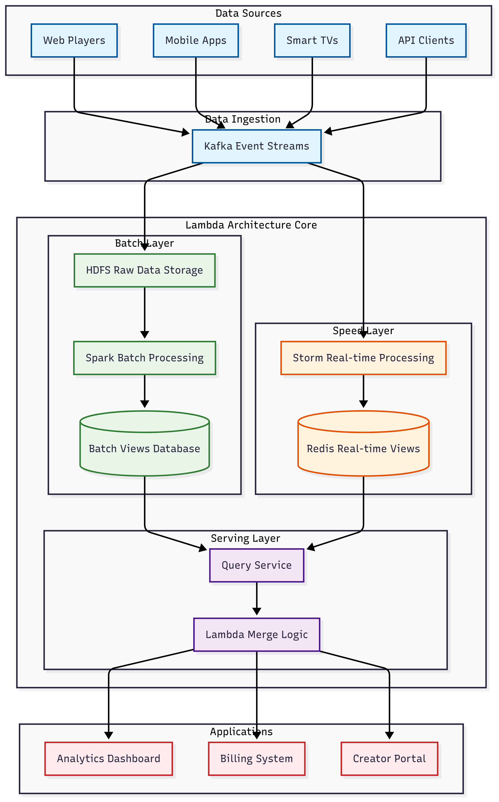
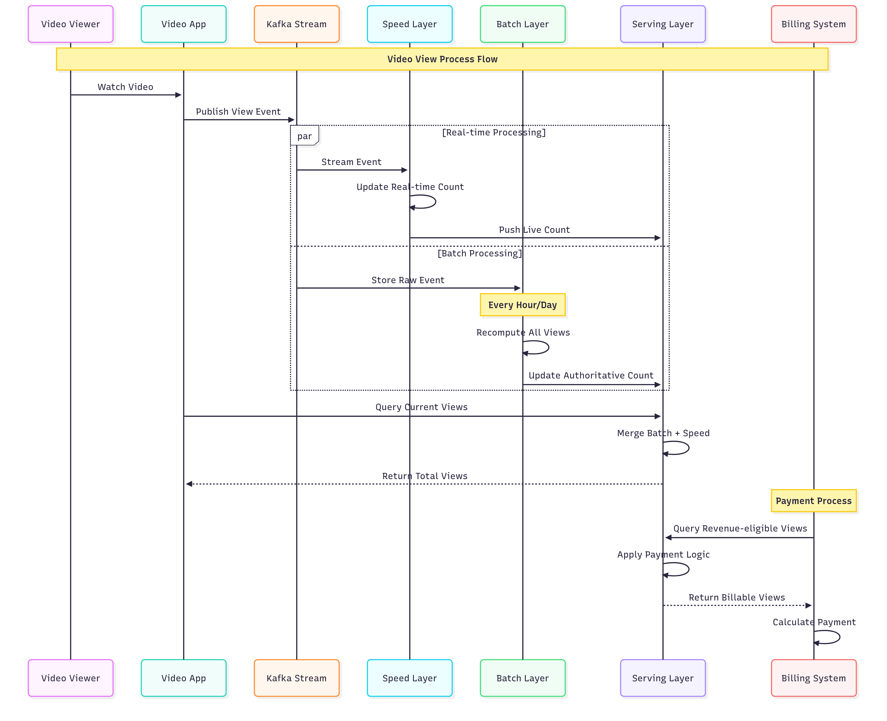
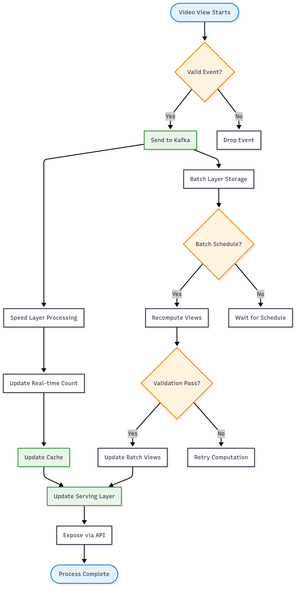

# Liệt kê các đặc tính chất lượng mong muốn đạt được đối với Lambda Architecture. Liệt kê các công cụ có thể sử dụng và các bước cần thực hiện, để kiểm tra các đặc tính chất lương này. Vẽ và giải thích góc nhìn logic và góc nhìn process của Lambda Architecture ? Giải thích các công cụ sử dụng và từng bước để viết mã nguồn cho tính năng đếm lượt xem rất lớn của một video, với độ chính xác cao và khả năng truy vết nhằm mục đích thanh toán tiền, theo góc nhìn logic và process đề xuất.

## 1. Đặc tính Chất lượng mong muốn của Lambda Architecture

### A. Fault Tolerance (Khả năng chịu lỗi)
**Định nghĩa**: Hệ thống tiếp tục hoạt động đúng ngay cả khi có failures ở các components

**Cách đạt được trong Lambda Architecture**:
- **Batch Layer**: Immutable data store, có thể recompute từ raw data
- **Speed Layer**: Incremental processing với checkpointing
- **Serving Layer**: Distributed storage với replication
- **Data redundancy**: Raw data được lưu ở nhiều nơi

**Targets cho Video View Counting**:
- Data loss: 0% (không mất view counts)
- Recovery time: <5 minutes sau failures
- Availability: 99.99% uptime

### B. Scalability (Khả năng mở rộng)
**Định nghĩa**: Xử lý được lượng data và traffic tăng lên theo thời gian

**Horizontal scaling capabilities**:
- **Batch processing**: Có thể add thêm computing nodes
- **Stream processing**: Partition-based scaling
- **Storage**: Sharding và distributed storage
- **Serving**: Load balancing across multiple instances

**Scale targets**:
- Video views: 100M+ views/day
- Concurrent users: 1M+ simultaneous viewers
- Data throughput: 10GB+/hour raw events
- Query response time: <100ms at any scale

### C. Low Latency (Độ trễ thấp)
**Định nghĩa**: Cung cấp results gần real-time cho users

**Real-time requirements**:
- **Speed Layer**: Process events trong <1 second
- **Query serving**: Return view counts trong <100ms
- **Data freshness**: View counts updated trong 5 seconds
- **Payment accuracy**: Real-time validation cho revenue calculations

### D. Accuracy (Độ chính xác)
**Định nghĩa**: Đảm bảo correctness của data và calculations

**Accuracy mechanisms**:
- **Batch Layer**: Provides "ground truth" từ complete data
- **Speed Layer**: Approximate results với error bounds
- **Lambda merge**: Combine batch + speed results
- **Exactly-once processing**: Prevent duplicate counting

**Accuracy targets cho payment**:
- View counting accuracy: 99.99%
- Revenue calculation accuracy: 100% (critical for payments)
- Fraud detection: 95%+ accuracy
- Audit trail: 100% traceability

### E. Extensibility (Khả năng mở rộng chức năng)
**Định nghĩa**: Dễ dàng thêm features mới và modify existing logic

**Benefits**:
- **Schema evolution**: Handle changing data formats
- **New algorithms**: Add advanced analytics without affecting existing
- **Multiple views**: Support different aggregation perspectives
- **A/B testing**: Easy to implement feature variations

## 2. Công cụ Kiểm tra Chất lượng

### A. Data Quality Testing

#### A.1 Batch Processing Quality
**Apache Spark Testing**:
```bash
# Basic data validation
spark-submit --class DataQualityTest batch-quality-test.jar
```

**Data Validation**:
```python
# Basic validation rules
expectations = [
    "video_id not null",
    "user_id not null", 
    "view_duration between 0 and 86400"
]
```

#### A.2 Stream Processing Quality
**Kafka Streams Testing**:
```java
// Simple test topology
TopologyTestDriver testDriver = new TopologyTestDriver(topology);
TestInputTopic<String, ViewEvent> inputTopic = testDriver.createInputTopic("video-views");
TestOutputTopic<String, ViewCount> outputTopic = testDriver.createOutputTopic("view-counts");
```

### B. Performance Testing

#### B.1 Basic Load Testing
**JMeter API Testing**:
- **Threads**: 1000 concurrent users
- **Duration**: 5 minutes
- **Target**: `/videos/{videoId}/views`
- **Expected**: Response time < 100ms

#### B.2 Stream Performance
**Kafka Performance Test**:
```bash
# Basic producer test
kafka-producer-perf-test.sh --topic video-views --num-records 100000

# Basic consumer test  
kafka-consumer-perf-test.sh --topic video-views --messages 100000
```

### C. Accuracy Testing

**Simple Accuracy Test**:
```python
# Basic accuracy validation
class ViewCountAccuracyTest:
    def test_batch_vs_speed_consistency(self):
        test_events = self.generate_test_views(1000)
        speed_result = self.speed_layer.process(test_events)
        batch_result = self.batch_layer.process(test_events)
        
        accuracy = self.compare_results(batch_result, speed_result)
        assert accuracy > 0.99  # 99% accuracy threshold
        
    def test_payment_accuracy(self):
        views = self.load_test_views()
        calculated = self.revenue_calculator.calculate(views)
        expected = self.manual_calculation(views)
        assert abs(calculated - expected) < 0.01
```

## 3. Góc nhìn Logic của Lambda Architecture

### 3.1 Logical Architecture Overview



### 3.2 Data Flow Logic

#### A. Raw Data Schema
```json
{
  "event_id": "uuid",
  "video_id": "string",
  "user_id": "string", 
  "session_id": "string",
  "timestamp": "iso8601",
  "view_duration": "integer (seconds)",
  "device_type": "string",
  "geo_location": "string",
  "referrer": "string",
  "quality": "string (720p, 1080p, etc)",
  "revenue_eligible": "boolean",
  "ad_views": ["array of ad events"]
}
```

#### B. Batch Layer Logic
**Purpose**: Compute accurate, complete views từ all historical data
**Processing**: Daily/hourly batch jobs tính toán view counts
**Output**: Authoritative view counts cho billing và analytics

#### C. Speed Layer Logic  
**Purpose**: Provide real-time updates cho current view counts
**Processing**: Stream processing của live events
**Output**: Incremental view counts với low latency

#### D. Serving Layer Logic
**Purpose**: Merge batch và speed layer results
**Query Logic**: 
```
Total Views = Batch Views (up to last batch) + Speed Views (since last batch)
```

## 4. Góc nhìn Process của Lambda Architecture

### 4.1 Process Flow Diagram



### 4.2 Detailed Process Workflows

#### A. View Event Processing Workflow


## 5. Công cụ Implementation cho Video View Counting

### 5.1 Technology Stack

#### A. Data Ingestion Layer
```yaml
Apache Kafka:
  Purpose: Real-time event streaming
  Topics: video-views, ad-views, user-sessions
  Partitions: 12 
  Replication: 3

Kafka Connect:
  Purpose: Data integration
  HDFS Sink: Store raw events
  Elasticsearch Sink: Search và analytics
```

#### B. Batch Layer Stack
```yaml
Apache Hadoop HDFS:
  Purpose: Distributed storage
  Block size: 128MB
  Replication factor: 3

Apache Spark:
  Purpose: Large-scale batch processing
  Cluster mode: YARN
  Executors: 20 nodes
```

#### C. Speed Layer Stack
```yaml
Apache Storm:
  Purpose: Real-time stream processing
  Workers: 10 nodes
  Parallelism: 48 threads

Redis Cluster:
  Purpose: Fast access cho real-time data
  Nodes: 6 (3 masters, 3 slaves)
  Memory: 16GB per node
```

### 5.2 Simple Code Implementation

#### A. View Event Data Model
```python
# Basic view event model
@dataclass
class ViewEvent:
    video_id: str
    user_id: str
    timestamp: datetime
    view_duration: int
    revenue_eligible: bool
    
    def to_dict(self):
        return {
            'video_id': self.video_id,
            'user_id': self.user_id,
            'timestamp': self.timestamp.isoformat(),
            'view_duration': self.view_duration,
            'revenue_eligible': self.revenue_eligible
        }
```

#### B. Kafka Producer
```python
# Simple Kafka producer
class ViewEventProducer:
    def __init__(self):
        self.producer = KafkaProducer(
            bootstrap_servers=['localhost:9092'],
            value_serializer=lambda v: json.dumps(v).encode('utf-8')
        )
    
    def send_view_event(self, view_event: ViewEvent):
        self.producer.send('video-views', value=view_event.to_dict())
        print(f"Sent view event for video: {view_event.video_id}")
```

#### C. Speed Layer Processing
```python
# Real-time processing
class RealTimeViewProcessor:
    def __init__(self):
        self.redis_client = redis.Redis(host='localhost', port=6379)
        self.consumer = KafkaConsumer('video-views', bootstrap_servers=['localhost:9092'])
    
    def process_events(self):
        for message in self.consumer:
            view_event = message.value
            video_id = view_event['video_id']
            
            # Update view count
            self.redis_client.incr(f"views:{video_id}")
            
            # Update revenue views
            if view_event['revenue_eligible']:
                self.redis_client.incr(f"revenue_views:{video_id}")
            
            print(f"Updated views for {video_id}")
```

#### D. Batch Layer Processing
```python
# Batch processing với Spark
class BatchViewProcessor:
    def __init__(self):
        self.spark = SparkSession.builder.appName("VideoViewBatch").getOrCreate()
    
    def process_daily_views(self, date):
        # Read events from HDFS
        events_df = self.spark.read.json(f"hdfs://raw-events/{date}/*.json")
        
        # Calculate view counts
        view_counts = events_df.groupBy("video_id").agg(
            count("*").alias("total_views"),
            sum(when(col("revenue_eligible") == True, 1)).alias("revenue_views")
        )
        
        # Save results
        view_counts.write.mode("overwrite").saveAsTable("video_views_batch")
        print(f"Processed batch for {date}")
```

#### E. Serving Layer
```python
# Query service combining batch + speed
class ViewCountService:
    def __init__(self):
        self.redis_client = redis.Redis()
        self.spark = SparkSession.builder.appName("QueryService").getOrCreate()
    
    def get_total_views(self, video_id):
        # Get batch views
        batch_df = self.spark.sql(f"SELECT * FROM video_views_batch WHERE video_id = '{video_id}'")
        batch_views = batch_df.first()['total_views'] if batch_df.count() > 0 else 0
        
        # Get speed views  
        speed_views = int(self.redis_client.get(f"views:{video_id}") or 0)
        
        return {
            'video_id': video_id,
            'total_views': batch_views + speed_views,
            'batch_views': batch_views,
            'realtime_views': speed_views
        }
```

#### F. Payment Calculation Service
```python
# Simple payment calculation
class PaymentCalculator:
    def __init__(self):
        self.view_service = ViewCountService()
        
    def calculate_revenue(self, video_id, rate_per_view=0.001):
        view_data = self.view_service.get_total_views(video_id)
        revenue_views = view_data.get('revenue_views', 0)
        
        total_revenue = revenue_views * rate_per_view
        
        # Store audit trail
        audit_record = {
            'video_id': video_id,
            'revenue_views': revenue_views,
            'total_revenue': total_revenue,
            'timestamp': datetime.now().isoformat()
        }
        
        return total_revenue
```

## 6. Deployment và Monitoring

### 6.1 Basic Deployment
```yaml
# docker-compose.yml
version: '3.8'
services:
  kafka:
    image: confluentinc/cp-kafka:latest
    ports:
      - "9092:9092"
      
  redis:
    image: redis:alpine
    ports:
      - "6379:6379"
      
  spark:
    image: bitnami/spark:latest
    ports:
      - "8080:8080"
```

### 6.2 Simple Monitoring
```python
# Basic metrics tracking
from prometheus_client import Counter, Histogram

view_events_total = Counter('view_events_total', 'Total view events')
processing_latency = Histogram('processing_latency_seconds', 'Processing latency')

def track_view_event():
    view_events_total.inc()
```

---

Lambda Architecture cho video view counting cung cấp:

- **High Accuracy**: Batch layer đảm bảo correctness
- **Low Latency**: Speed layer cung cấp real-time updates  
- **Fault Tolerance**: Data được lưu trữ redundant
- **Scalability**: Horizontal scaling cho tất cả layers
- **Auditability**: Complete traceability cho payment calculations

Implementation này đảm bảo độ chính xác cao cho thanh toán và khả năng truy vết hoàn chỉnh.