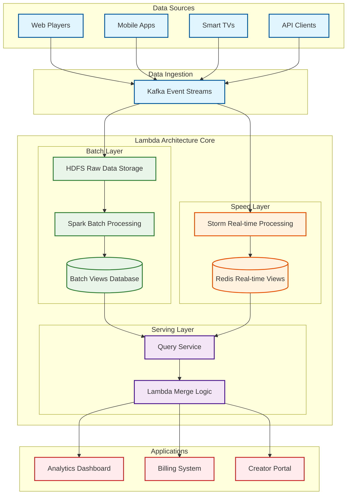
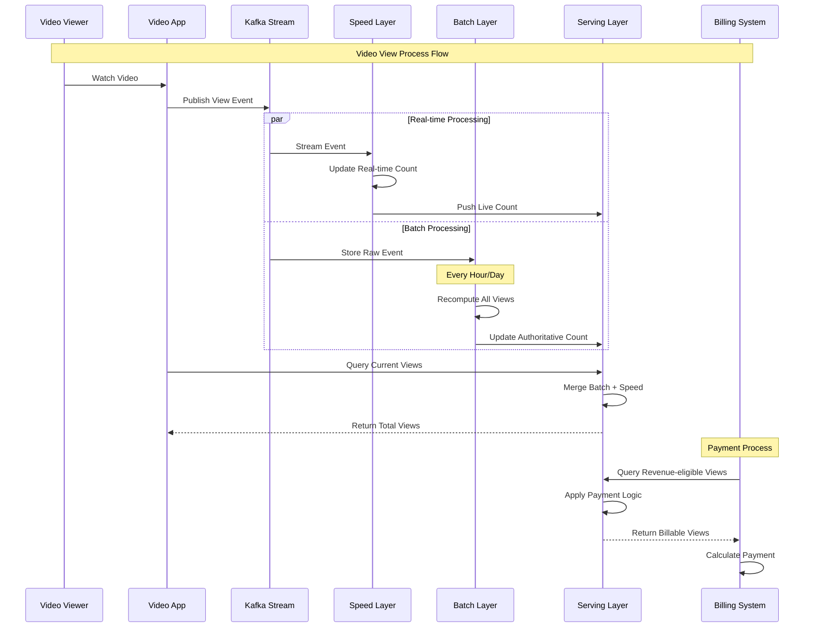
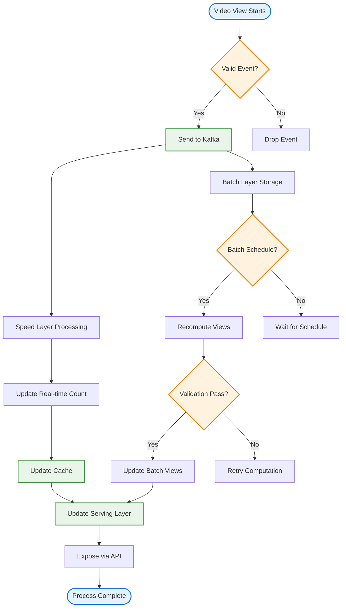

# Liệt kê các đặc tính chất lượng mong muốn đạt được đối với Lambda Architecture. Liệt kê các công cụ có thể sử dụng và các bước cần thực hiện, để kiểm tra các đặc tính chất lương này. Vẽ và giải thích góc nhìn logic và góc nhìn process của Lambda Architecture ? Giải thích các công cụ sử dụng và từng bước để viết mã nguồn cho tính năng đếm lượt xem rất lớn của một video, với độ chính xác cao và khả năng truy vết nhằm mục đích thanh toán tiền, theo góc nhìn logic và process đề xuất.

## 1. Đặc tính Chất lượng mong muốn của Lambda Architecture

### A. Fault Tolerance (Khả năng chịu lỗi)
**Định nghĩa**: Hệ thống tiếp tục hoạt động đúng ngay cả khi có failures ở các components

**Cách đạt được trong Lambda Architecture**:
- **Batch Layer**: Immutable data store, có thể recompute từ raw data
- **Speed Layer**: Incremental processing với checkpointing
- **Serving Layer**: Distributed storage với replication
- **Data redundancy**: Raw data được lưu ở nhiều nơi

**Targets cho Video View Counting**:
- Data loss: 0% (không mất view counts)
- Recovery time: <5 minutes sau failures
- Availability: 99.99% uptime

### B. Scalability (Khả năng mở rộng)
**Định nghĩa**: Xử lý được lượng data và traffic tăng lên theo thời gian

**Horizontal scaling capabilities**:
- **Batch processing**: Có thể add thêm computing nodes
- **Stream processing**: Partition-based scaling
- **Storage**: Sharding và distributed storage
- **Serving**: Load balancing across multiple instances

**Scale targets**:
- Video views: 100M+ views/day
- Concurrent users: 1M+ simultaneous viewers
- Data throughput: 10GB+/hour raw events
- Query response time: <100ms at any scale

### C. Low Latency (Độ trễ thấp)
**Định nghĩa**: Cung cấp results gần real-time cho users

**Real-time requirements**:
- **Speed Layer**: Process events trong <1 second
- **Query serving**: Return view counts trong <100ms
- **Data freshness**: View counts updated trong 5 seconds
- **Payment accuracy**: Real-time validation cho revenue calculations

### D. Accuracy (Độ chính xác)
**Định nghĩa**: Đảm bảo correctness của data và calculations

**Accuracy mechanisms**:
- **Batch Layer**: Provides "ground truth" từ complete data
- **Speed Layer**: Approximate results với error bounds
- **Lambda merge**: Combine batch + speed results
- **Exactly-once processing**: Prevent duplicate counting

**Accuracy targets cho payment**:
- View counting accuracy: 99.99%
- Revenue calculation accuracy: 100% (critical for payments)
- Fraud detection: 95%+ accuracy
- Audit trail: 100% traceability

### E. Extensibility (Khả năng mở rộng chức năng)
**Định nghĩa**: Dễ dàng thêm features mới và modify existing logic

**Benefits**:
- **Schema evolution**: Handle changing data formats
- **New algorithms**: Add advanced analytics without affecting existing
- **Multiple views**: Support different aggregation perspectives
- **A/B testing**: Easy to implement feature variations

## 2. Công cụ Kiểm tra Chất lượng

### A. Data Quality Testing

#### A.1 Batch Processing Quality Tools
**Apache Spark Testing Framework**:
```bash
# Data validation tests
spark-submit --class DataQualityTest \
  --master yarn \
  --deploy-mode cluster \
  batch-quality-test.jar
```

**Great Expectations cho Data Validation**:
```python
# Video view data expectations
expectations = [
    "expect_column_values_to_not_be_null": ["video_id", "user_id", "timestamp"],
    "expect_column_values_to_be_between": {
        "view_duration": {"min_value": 0, "max_value": 86400}
    },
    "expect_column_values_to_match_regex": {
        "video_id": "^[a-zA-Z0-9_-]+$"
    }
]
```

#### A.2 Stream Processing Quality Tools
**Kafka Streams Testing**:
```java
// Test topology for view counting
TopologyTestDriver testDriver = new TopologyTestDriver(topology, config);
TestInputTopic<String, ViewEvent> inputTopic = 
    testDriver.createInputTopic("video-views", stringSerde, viewEventSerde);
TestOutputTopic<String, ViewCount> outputTopic = 
    testDriver.createOutputTopic("view-counts", stringSerde, viewCountSerde);
```

### B. Performance Testing

#### B.1 Load Testing Tools
**Apache JMeter cho API Load Testing**:
```xml
<!-- JMeter test plan cho view API -->
<TestPlan>
  <ThreadGroup>
    <numThreads>1000</numThreads>
    <rampTime>60</rampTime>
    <duration>300</duration>
  </ThreadGroup>
  <HTTPSampler>
    <domain>api.video-platform.com</domain>
    <path>/videos/${videoId}/views</path>
    <method>GET</method>
  </HTTPSampler>
</TestPlan>
```

**Gatling cho High-Performance Testing**:
```scala
// Gatling scenario cho video view simulation
val viewScenario = scenario("Video View Load Test")
  .exec(http("Get View Count")
    .get("/api/videos/#{videoId}/views")
    .check(status.is(200))
    .check(responseTimeInMillis.lt(100)))

setUp(
  viewScenario.inject(rampUsers(10000) during (5 minutes))
).protocols(httpConf)
```

#### B.2 Stream Processing Performance
**Kafka Performance Testing**:
```bash
# Producer performance test
kafka-producer-perf-test.sh \
  --topic video-views \
  --num-records 1000000 \
  --record-size 512 \
  --throughput 50000 \
  --producer-props bootstrap.servers=localhost:9092

# Consumer performance test  
kafka-consumer-perf-test.sh \
  --topic video-views \
  --messages 1000000 \
  --bootstrap-server localhost:9092
```

### C. Accuracy Testing

#### C.1 End-to-End Accuracy Validation
**Test Framework**:
```python
# E2E accuracy test cho view counting
class ViewCountAccuracyTest:
    def test_batch_vs_speed_consistency(self):
        # Generate known test data
        test_events = self.generate_test_views(count=10000)
        
        # Process through speed layer
        speed_result = self.speed_layer.process(test_events)
        
        # Process through batch layer
        batch_result = self.batch_layer.process(test_events)
        
        # Compare results
        accuracy = self.compare_results(batch_result, speed_result)
        assert accuracy > 0.999  # 99.9% accuracy threshold
        
    def test_payment_calculation_accuracy(self):
        # Test revenue calculation accuracy
        views = self.load_test_views()
        calculated_revenue = self.revenue_calculator.calculate(views)
        expected_revenue = self.manual_calculation(views)
        
        assert abs(calculated_revenue - expected_revenue) < 0.01
```

## 3. Góc nhìn Logic của Lambda Architecture

### 3.1 Logical Architecture Overview



### 3.2 Data Flow Logic

#### A. Raw Data Schema
```json
{
  "event_id": "uuid",
  "video_id": "string",
  "user_id": "string", 
  "session_id": "string",
  "timestamp": "iso8601",
  "view_duration": "integer (seconds)",
  "device_type": "string",
  "geo_location": "string",
  "referrer": "string",
  "quality": "string (720p, 1080p, etc)",
  "revenue_eligible": "boolean",
  "ad_views": ["array of ad events"]
}
```

#### B. Batch Layer Logic
**Purpose**: Compute accurate, complete views từ all historical data
**Processing**: Daily/hourly batch jobs tính toán view counts
**Output**: Authoritative view counts cho billing và analytics

#### C. Speed Layer Logic  
**Purpose**: Provide real-time updates cho current view counts
**Processing**: Stream processing của live events
**Output**: Incremental view counts với low latency

#### D. Serving Layer Logic
**Purpose**: Merge batch và speed layer results
**Query Logic**: 
```
Total Views = Batch Views (up to last batch) + Speed Views (since last batch)
```

## 4. Góc nhìn Process của Lambda Architecture

### 4.1 Process Flow Diagram



### 4.2 Detailed Process Workflows

#### A. View Event Processing Workflow


## 5. Công cụ Implementation cho Video View Counting

### 5.1 Technology Stack

#### A. Data Ingestion Layer
```yaml
Apache Kafka:
  Purpose: Real-time event streaming
  Configuration:
    - Topics: video-views, ad-views, user-sessions
    - Partitions: 12 (để scale processing)
    - Replication: 3 (cho fault tolerance)
    - Retention: 7 days (cho batch reprocessing)

Kafka Connect:
  Purpose: Data integration với external systems
  Connectors:
    - HDFS Sink: Store raw events
    - Elasticsearch Sink: Search và analytics
```

#### B. Batch Layer Stack
```yaml
Apache Hadoop HDFS:
  Purpose: Distributed storage cho raw data
  Configuration:
    - Block size: 128MB
    - Replication factor: 3
    - Compression: Snappy

Apache Spark:
  Purpose: Large-scale batch processing
  Configuration:
    - Cluster mode: YARN
    - Executors: 20 nodes
    - Memory per executor: 8GB
    - Cores per executor: 4
```

#### C. Speed Layer Stack
```yaml
Apache Storm:
  Purpose: Real-time stream processing
  Configuration:
    - Workers: 10 nodes
    - Parallelism: 48 threads
    - Message timeout: 30 seconds

Redis Cluster:
  Purpose: Fast access cho real-time data
  Configuration:
    - Nodes: 6 (3 masters, 3 slaves)
    - Memory: 16GB per node
    - Persistence: RDB + AOF
```

### 5.2 Simple Code Implementation

#### A. View Event Data Model
```python
# models/view_event.py
from dataclasses import dataclass
from datetime import datetime
from typing import Optional

@dataclass
class ViewEvent:
    event_id: str
    video_id: str
    user_id: str
    timestamp: datetime
    view_duration: int  # seconds
    device_type: str
    revenue_eligible: bool
    
    def to_dict(self):
        return {
            'event_id': self.event_id,
            'video_id': self.video_id,
            'user_id': self.user_id,
            'timestamp': self.timestamp.isoformat(),
            'view_duration': self.view_duration,
            'device_type': self.device_type,
            'revenue_eligible': self.revenue_eligible
        }
```

#### B. Kafka Producer (Simple)
```python
# ingestion/kafka_producer.py
from kafka import KafkaProducer
import json

class ViewEventProducer:
    def __init__(self):
        self.producer = KafkaProducer(
            bootstrap_servers=['localhost:9092'],
            value_serializer=lambda v: json.dumps(v).encode('utf-8')
        )
    
    def send_view_event(self, view_event: ViewEvent):
        try:
            # Send to video-views topic
            self.producer.send(
                'video-views', 
                key=view_event.video_id.encode('utf-8'),
                value=view_event.to_dict()
            )
            print(f"Sent view event: {view_event.event_id}")
            
        except Exception as e:
            print(f"Error sending event: {e}")
```

#### C. Speed Layer Processing (Simple)
```python
# speed_layer/storm_processor.py
import redis
from kafka import KafkaConsumer
import json

class RealTimeViewProcessor:
    def __init__(self):
        self.redis_client = redis.Redis(host='localhost', port=6379, db=0)
        self.consumer = KafkaConsumer(
            'video-views',
            bootstrap_servers=['localhost:9092'],
            value_deserializer=lambda m: json.loads(m.decode('utf-8'))
        )
    
    def process_events(self):
        for message in self.consumer:
            view_event = message.value
            video_id = view_event['video_id']
            
            # Update real-time view count
            current_count = self.redis_client.get(f"views:{video_id}")
            if current_count:
                new_count = int(current_count) + 1
            else:
                new_count = 1
                
            self.redis_client.set(f"views:{video_id}", new_count)
            
            # Update revenue-eligible views
            if view_event['revenue_eligible']:
                revenue_key = f"revenue_views:{video_id}"
                self.redis_client.incr(revenue_key)
            
            print(f"Updated views for {video_id}: {new_count}")
```

#### D. Batch Layer Processing (Simple)
```python
# batch_layer/spark_processor.py
from pyspark.sql import SparkSession
from pyspark.sql.functions import *

class BatchViewProcessor:
    def __init__(self):
        self.spark = SparkSession.builder \
            .appName("VideoViewBatchProcessor") \
            .getOrCreate()
    
    def process_daily_views(self, date):
        # Read raw events from HDFS
        events_df = self.spark.read.json(f"hdfs://raw-events/{date}/*.json")
        
        # Calculate total views per video
        view_counts = events_df.groupBy("video_id") \
            .agg(
                count("*").alias("total_views"),
                sum(when(col("revenue_eligible") == True, 1).otherwise(0)).alias("revenue_views"),
                avg("view_duration").alias("avg_duration")
            )
        
        # Save to batch views table
        view_counts.write \
            .mode("overwrite") \
            .option("path", f"hdfs://batch-views/{date}") \
            .saveAsTable("video_views_batch")
        
        print(f"Processed batch views for {date}")
```

#### E. Serving Layer (Simple)
```python
# serving_layer/query_service.py
import redis
from pyspark.sql import SparkSession

class ViewCountService:
    def __init__(self):
        self.redis_client = redis.Redis(host='localhost', port=6379, db=0)
        self.spark = SparkSession.builder.appName("QueryService").getOrCreate()
    
    def get_total_views(self, video_id):
        # Get batch views (up to yesterday)
        batch_df = self.spark.sql(f"""
            SELECT total_views, revenue_views 
            FROM video_views_batch 
            WHERE video_id = '{video_id}'
        """)
        
        batch_views = 0
        batch_revenue = 0
        if batch_df.count() > 0:
            row = batch_df.first()
            batch_views = row['total_views']
            batch_revenue = row['revenue_views']
        
        # Get real-time views (today)
        speed_views = self.redis_client.get(f"views:{video_id}")
        speed_revenue = self.redis_client.get(f"revenue_views:{video_id}")
        
        speed_views = int(speed_views) if speed_views else 0
        speed_revenue = int(speed_revenue) if speed_revenue else 0
        
        return {
            'video_id': video_id,
            'total_views': batch_views + speed_views,
            'revenue_views': batch_revenue + speed_revenue,
            'batch_views': batch_views,
            'realtime_views': speed_views
        }
```

#### F. Payment Calculation Service (Simple)
```python
# billing/payment_service.py
class PaymentCalculator:
    def __init__(self):
        self.view_service = ViewCountService()
        
    def calculate_revenue(self, video_id, rate_per_view=0.001):
        view_data = self.view_service.get_total_views(video_id)
        revenue_views = view_data['revenue_views']
        
        # Calculate payment
        total_revenue = revenue_views * rate_per_view
        
        # Audit trail
        audit_record = {
            'video_id': video_id,
            'revenue_views': revenue_views,
            'rate_per_view': rate_per_view,
            'total_revenue': total_revenue,
            'calculation_timestamp': datetime.now().isoformat(),
            'batch_views': view_data['batch_views'],
            'realtime_views': view_data['realtime_views']
        }
        
        # Store audit trail
        self.store_audit_record(audit_record)
        
        return total_revenue
    
    def store_audit_record(self, record):
        # Store in audit database for traceability
        pass  # Implementation depends on audit storage choice
```

## 6. Deployment và Monitoring

### 6.1 Simple Deployment
```yaml
# docker-compose.yml
version: '3.8'
services:
  kafka:
    image: confluentinc/cp-kafka:latest
    ports:
      - "9092:9092"
    environment:
      KAFKA_ZOOKEEPER_CONNECT: zookeeper:2181
      KAFKA_ADVERTISED_LISTENERS: PLAINTEXT://localhost:9092
      
  redis:
    image: redis:alpine
    ports:
      - "6379:6379"
      
  spark:
    image: bitnami/spark:latest
    ports:
      - "8080:8080"
    environment:
      SPARK_MODE: master
```

### 6.2 Monitoring Setup
```python
# monitoring/metrics.py
from prometheus_client import Counter, Histogram, Gauge

# Metrics for monitoring
view_events_total = Counter('view_events_total', 'Total view events processed')
processing_latency = Histogram('processing_latency_seconds', 'Event processing latency')
active_viewers = Gauge('active_viewers', 'Current active viewers')

def track_view_event():
    view_events_total.inc()

def track_processing_time(duration):
    processing_latency.observe(duration)
```


